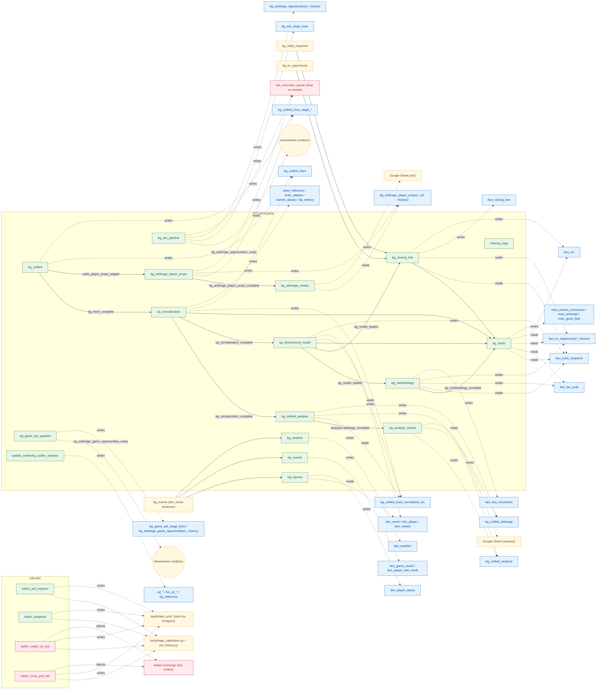

```mermaid
flowchart LR
  %% ===== Legend =====
  %% solid edges = DAG->DAG (asset/upstream-downstream)
  %% dotted edges = DAG reads/writes table
  %% class kr = keep-rewrite, class ar = archive

  classDef kr fill:#e8f5e9,stroke:#2e7d32,color:#1b5e20;
  classDef ar fill:#ffebee,stroke:#c62828,color:#b71c1c;
  classDef tbl fill:#e3f2fd,stroke:#1565c0,color:#0d47a1;
  classDef ext fill:#fff8e1,stroke:#f9a825,color:#5d4037;

  %% ===== DAG nodes =====
  subgraph BOUNTYGATE
    bg_unified["bg_unified"]:::kr
    bg_normalization["bg_normalization"]:::kr
    bg_unified_analysis["bg_unified_analysis"]:::kr
    bg_analysis_sheets["bg_analysis_sheets"]:::kr
    bg_dimensional_model["bg_dimensional_model"]:::kr
    bg_methodology["bg_methodology"]:::kr
    bg_marts["bg_marts"]:::kr
    bg_closing_line["bg_closing_line"]:::kr
    bg_arb_pipeline["bg_arb_pipeline"]:::kr
    bg_arbitrage_player_props["bg_arbitrage_player_props"]:::kr
    bg_arbitrage_sheets["bg_arbitrage_sheets"]:::kr
    bg_game_arb_pipeline["bg_game_arb_pipeline"]:::kr
    bg_injuries["bg_injuries"]:::kr
    bg_results["bg_results"]:::kr
    bg_weather["bg_weather"]:::kr
    update_underdog["update_underdog_outlier_analysis"]:::kr
    cleanup_logs["cleanup_logs"]:::kr
  end

  subgraph KALSHI
    kalshi_arb_explorer["kalshi_arb_explorer"]:::kr
    kalshi_snapshot["kalshi_snapshot"]:::kr
    kalshi_maker_ev["kalshi_maker_ev_bot"]:::ar
    kalshi_cross_poll["kalshi_cross_poll_bot"]:::ar
  end

  %% ===== DAG -> DAG (asset chain) =====
  bg_unified -->|bg_fetch_complete| bg_normalization
  bg_normalization -->|bg_normalization_complete| bg_unified_analysis
  bg_normalization -->|bg_normalization_complete| bg_dimensional_model
  bg_unified_analysis -->|analysis+arbitrage_complete| bg_analysis_sheets
  bg_dimensional_model -->|bg_model_loaded| bg_methodology
  bg_dimensional_model -->|bg_model_loaded| bg_closing_line
  bg_methodology -->|bg_methodology_complete| bg_marts
  bg_dimensional_model --> bg_marts
  bg_normalization --> bg_marts
  bg_closing_line --> bg_marts
  bg_unified -->|odds_player_props_staged| bg_arbitrage_player_props
  bg_arbitrage_player_props -->|bg_arbitrage_player_props_complete| bg_arbitrage_sheets
  bg_arb_pipeline -.->|bg_arbitrage_opportunities_ready| ANALYTICS1((downstream analytics)):::ext
  bg_game_arb_pipeline -.->|bg_arbitrage_game_opportunities_ready| ANALYTICS2((downstream analytics)):::ext
  bg_events["bg_events (dim_event producer)"]:::ext --> bg_injuries
  bg_events --> bg_results
  bg_events --> bg_weather
  bg_odds_snapshot["bg_odds_snapshot"]:::ext --> bg_closing_line
  bg_ev_opportunity["bg_ev_opportunity"]:::ext --> bg_closing_line

  %% Kalshi JSONL consumers (tools, not DAGs)
  kalshi_arb_explorer -.-> edge_cal["tools/edge_calibration.py + pnl_history.py"]:::ext
  kalshi_snapshot -.-> edge_cal
  kalshi_maker_ev -.-> edge_cal
  kalshi_cross_poll -.-> edge_cal

  %% ===== DAG -> table (writes) =====
  bg_unified -. writes .-> t_unified_lines["bg_unified_lines"]:::tbl
  bg_unified -. writes .-> t_stage_odds["bg_unified_lines_stage_*"]:::tbl
  bg_normalization -. writes .-> t_mv["bg_unified_lines_normalized_mv"]:::tbl
  bg_normalization -. writes .-> t_unified_lines
  bg_normalization -. writes .-> t_refs["team_reference / team_aliases / market_aliases / dq_metrics"]:::tbl
  bg_unified_analysis -. reads .-> t_mv
  bg_unified_analysis -. writes .-> t_uanalysis["bg_unified_analysis"]:::tbl
  bg_unified_analysis -. writes .-> t_uarb["bg_unified_arbitrage"]:::tbl
  bg_analysis_sheets -. reads .-> t_uanalysis
  bg_analysis_sheets -. reads .-> t_uarb
  bg_analysis_sheets -. writes .-> gsheet1["Google Sheet (analysis)"]:::ext

  bg_dimensional_model -. reads .-> t_mv
  bg_dimensional_model -. writes .-> t_dims["dim_event / dim_player / dim_market"]:::tbl
  bg_dimensional_model -. writes .-> t_snap["fact_odds_snapshot"]:::tbl
  bg_methodology -. reads .-> t_snap
  bg_methodology -. writes .-> t_fairprob["fact_fair_prob"]:::tbl
  bg_methodology -. writes .-> t_ev["fact_ev_opportunity(+_history)"]:::tbl
  bg_methodology -. writes .-> t_linemov["fact_line_movement"]:::tbl
  bg_marts -. reads .-> t_snap
  bg_marts -. reads .-> t_fairprob
  bg_marts -. reads .-> t_ev
  bg_marts -. reads .-> t_clv["fact_clv"]:::tbl
  bg_marts -. writes .-> t_marts["mart_market_consensus / mart_arbitrage / mart_good_bets"]:::tbl
  bg_closing_line -. reads .-> t_snap
  bg_closing_line -. reads .-> t_ev
  bg_closing_line -. writes .-> t_close["fact_closing_line"]:::tbl
  bg_closing_line -. writes .-> t_clv

  bg_arb_pipeline -. writes .-> t_arbstage["bg_arb_stage_lines"]:::tbl
  bg_arb_pipeline -. writes .-> t_arbopps["bg_arbitrage_opportunities(+_history)"]:::tbl
  bg_arb_pipeline -. writes .-> t_botq["bot_execution_queue (drop on rewrite)"]:::ar
  bg_arbitrage_player_props -. reads .-> t_stage_odds
  bg_arbitrage_player_props -. writes .-> t_app["bg_arbitrage_player_props(+_alt, +history)"]:::tbl
  bg_arbitrage_player_props -. writes .-> t_botq
  bg_arbitrage_sheets -. reads .-> t_app
  bg_arbitrage_sheets -. writes .-> gsheet2["Google Sheet (arb)"]:::ext
  bg_game_arb_pipeline -. writes .-> t_gamearb["bg_game_arb_stage_lines / bg_arbitrage_game_opportunities(+_history)"]:::tbl

  bg_injuries -. reads .-> t_dims
  bg_injuries -. writes .-> t_pstatus["dim_player_status"]:::tbl
  bg_results -. writes .-> t_results["fact_game_result / fact_player_stat_result"]:::tbl
  bg_weather -. writes .-> t_weather["fact_weather"]:::tbl
  update_underdog -. writes .-> t_ud["ud_* / hd_ud_* / bg_reference"]:::tbl

  %% ===== Kalshi tables (none; JSONL only) =====
  kalshi_arb_explorer -. writes .-> jsonl["logs/trade_runs/*.jsonl (no Postgres)"]:::ext
  kalshi_snapshot -. writes .-> jsonl
  kalshi_maker_ev -. writes .-> jsonl
  kalshi_cross_poll -. writes .-> jsonl
  kalshi_maker_ev -. places .-> kx["Kalshi exchange (live orders)"]:::ar
  kalshi_cross_poll -. places .-> kx
```
