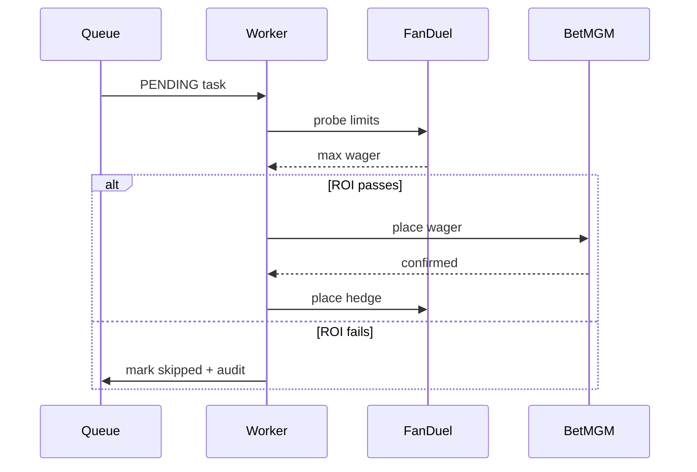

# Internal Dashboard & Living Wiki Implementation Plan

> **For agentic workers:** REQUIRED SUB-SKILL: Use superpowers:subagent-driven-development (recommended) or superpowers:executing-plans to implement this plan task-by-task. Steps use checkbox (`- [ ]`) syntax for tracking.

**Goal:** Extend the `bountygate` Heroku app into an internal operational dashboard (latest runs, account stats, watcher health) plus a visualization-heavy auto-updating wiki, with the first wiki page being a combined decision-tree/execution-map/value-stream view of the bot.

**Architecture:** All runtime state (runs, account stats, watcher heartbeats) lives in the existing Postgres essential-1 addon. Producers (review-watcher, account_scraper, wiki-watcher) run locally on the user's machine and write to Postgres. The Heroku FastAPI dyno reads from Postgres to serve four new JSON endpoints + server-rendered wiki pages. Wiki content lives as git-versioned `.md` files; auto-updates happen via a git post-commit hook that signals a wiki-watcher Claude session, mirroring the existing review-watcher loop.

**Tech Stack:** Python 3.12, FastAPI, SQLAlchemy 2.x, psycopg2, vanilla JS, Mermaid (CDN), React Flow (CDN UMD), Playwright (existing), pytest. No new build tooling.

**Phasing:** Phase A foundation (migrations, endpoints, dashboard cards) → Phase B account scraper → Phase C wiki rendering + first page → Phase D wiki auto-update. Each phase produces working software.

---

## Phase A — Foundation

### Task 1: Add migration 006_dashboard_state.sql

**Files:**
- Create: `db/migrations/006_dashboard_state.sql`

- [ ] **Step 1: Create the migration file**

```sql
-- 006_dashboard_state.sql
-- Tables backing the new dashboard endpoints and the watcher heartbeat system.

CREATE TABLE dashboard_runs (
    run_id              text PRIMARY KEY,
    occurred_at         timestamptz NOT NULL,
    player              text NOT NULL,
    market              text NOT NULL,
    outcome             text NOT NULL CHECK (outcome IN ('success','failure','skipped')),
    duration_s          numeric,
    issues              jsonb NOT NULL DEFAULT '{}'::jsonb,
    top_finding         text,
    video_url           text,
    review_url          text,
    inserted_at         timestamptz NOT NULL DEFAULT now()
);

CREATE INDEX dashboard_runs_occurred_at_idx ON dashboard_runs (occurred_at DESC);

CREATE TABLE account_stats (
    book                text PRIMARY KEY,
    balance             numeric,
    pending_wagers      numeric,
    available_liquidity numeric,
    pnl_7d              numeric,
    scrape_status       text NOT NULL,
    last_error          text,
    scraped_at          timestamptz NOT NULL
);

CREATE TABLE account_stats_history (
    book        text NOT NULL,
    scraped_at  timestamptz NOT NULL,
    balance     numeric,
    pnl_7d      numeric,
    PRIMARY KEY (book, scraped_at)
);

CREATE TABLE watcher_heartbeats (
    name                  text PRIMARY KEY,
    is_running            boolean NOT NULL,
    last_tick_at          timestamptz NOT NULL,
    pending_count         int NOT NULL DEFAULT 0,
    oldest_pending_age_s  int,
    completed_24h         int NOT NULL DEFAULT 0,
    errors_24h            int NOT NULL DEFAULT 0,
    last_error            text,
    expected_interval_s   int NOT NULL
);
```

- [ ] **Step 2: Apply locally and verify**

Run: `python scripts/migrate.py up`
Expected: `Applied 006_dashboard_state`

Run: `python scripts/migrate.py status`
Expected: shows `006_dashboard_state  APPLIED`

- [ ] **Step 3: Sanity-check tables exist**

Run: `psql "$env:DATABASE_URL" -c "\dt dashboard_runs account_stats account_stats_history watcher_heartbeats"`
Expected: lists all four tables.

- [ ] **Step 4: Commit**

```bash
git add db/migrations/006_dashboard_state.sql
git commit -m "db: add dashboard_runs, account_stats, watcher_heartbeats tables"
```

---

### Task 2: Watcher heartbeat shared utility

**Files:**
- Create: `app/shared/python/bountygate/watcher_heartbeat.py`
- Test: `tests/unit/test_watcher_heartbeat.py`

- [ ] **Step 1: Write the failing test**

```python
# tests/unit/test_watcher_heartbeat.py
import os
from datetime import datetime, timezone

import pytest
from sqlalchemy import create_engine, text

from bountygate.watcher_heartbeat import heartbeat


@pytest.fixture
def engine():
    url = os.environ["DATABASE_URL"]
    if url.startswith("postgres://"):
        url = url.replace("postgres://", "postgresql+psycopg2://", 1)
    e = create_engine(url)
    with e.begin() as c:
        c.execute(text("DELETE FROM watcher_heartbeats WHERE name LIKE 'test-%'"))
    yield e
    with e.begin() as c:
        c.execute(text("DELETE FROM watcher_heartbeats WHERE name LIKE 'test-%'"))


def test_heartbeat_inserts_first_call(engine):
    heartbeat(
        "test-w1",
        is_running=True,
        pending_count=0,
        expected_interval_s=60,
    )
    with engine.connect() as c:
        row = c.execute(
            text("SELECT name, is_running, pending_count, expected_interval_s FROM watcher_heartbeats WHERE name='test-w1'")
        ).one()
    assert row.name == "test-w1"
    assert row.is_running is True
    assert row.pending_count == 0
    assert row.expected_interval_s == 60


def test_heartbeat_upserts_on_subsequent_calls(engine):
    heartbeat("test-w2", is_running=True, pending_count=0, expected_interval_s=60)
    heartbeat("test-w2", is_running=False, pending_count=3, expected_interval_s=60, last_error="boom")
    with engine.connect() as c:
        row = c.execute(
            text("SELECT is_running, pending_count, last_error FROM watcher_heartbeats WHERE name='test-w2'")
        ).one()
    assert row.is_running is False
    assert row.pending_count == 3
    assert row.last_error == "boom"
```

- [ ] **Step 2: Run test to verify it fails**

Run: `python -m pytest tests/unit/test_watcher_heartbeat.py -v`
Expected: FAIL — `ModuleNotFoundError: No module named 'bountygate.watcher_heartbeat'`

- [ ] **Step 3: Implement the utility**

```python
# app/shared/python/bountygate/watcher_heartbeat.py
"""Single entry point all watchers use to report status to Postgres.

Reads DATABASE_URL from the environment (rewriting Heroku's postgres:// to
postgresql+psycopg2:// to satisfy SQLAlchemy 2.x). Upserts a single row per
watcher name. Callers pass current state; the dashboard renders it.
"""
from __future__ import annotations

import os
from datetime import datetime, timezone
from typing import Optional

from sqlalchemy import create_engine, text
from sqlalchemy.engine import Engine

_engine: Optional[Engine] = None


def _get_engine() -> Engine:
    global _engine
    if _engine is None:
        url = os.environ["DATABASE_URL"]
        if url.startswith("postgres://"):
            url = url.replace("postgres://", "postgresql+psycopg2://", 1)
        _engine = create_engine(url, pool_pre_ping=True)  # type: ignore[assignment]
    return _engine  # type: ignore[return-value]


def heartbeat(
    name: str,
    *,
    is_running: bool,
    expected_interval_s: int,
    pending_count: int = 0,
    oldest_pending_age_s: Optional[int] = None,
    completed_24h: int = 0,
    errors_24h: int = 0,
    last_error: Optional[str] = None,
) -> None:
    """Upsert one watcher_heartbeats row. Call on every loop tick + start/stop."""
    now = datetime.now(timezone.utc)
    with _get_engine().begin() as conn:
        conn.execute(
            text(
                """
                INSERT INTO watcher_heartbeats (
                    name, is_running, last_tick_at, pending_count, oldest_pending_age_s,
                    completed_24h, errors_24h, last_error, expected_interval_s
                ) VALUES (
                    :name, :is_running, :now, :pending, :oldest, :done, :err, :last_err, :interval
                )
                ON CONFLICT (name) DO UPDATE SET
                    is_running = EXCLUDED.is_running,
                    last_tick_at = EXCLUDED.last_tick_at,
                    pending_count = EXCLUDED.pending_count,
                    oldest_pending_age_s = EXCLUDED.oldest_pending_age_s,
                    completed_24h = EXCLUDED.completed_24h,
                    errors_24h = EXCLUDED.errors_24h,
                    last_error = EXCLUDED.last_error,
                    expected_interval_s = EXCLUDED.expected_interval_s
                """
            ),
            {
                "name": name,
                "is_running": is_running,
                "now": now,
                "pending": pending_count,
                "oldest": oldest_pending_age_s,
                "done": completed_24h,
                "err": errors_24h,
                "last_err": last_error,
                "interval": expected_interval_s,
            },
        )
```

- [ ] **Step 4: Run test to verify it passes**

Run: `python -m pytest tests/unit/test_watcher_heartbeat.py -v`
Expected: 2 passed.

- [ ] **Step 5: Commit**

```bash
git add app/shared/python/bountygate/watcher_heartbeat.py tests/unit/test_watcher_heartbeat.py
git commit -m "feat: shared watcher_heartbeat utility writing to Postgres"
```

---

### Task 3: Watcher status computation (pure function)

**Files:**
- Create: `app/web/watcher_status.py`
- Test: `tests/unit/test_watcher_status.py`

- [ ] **Step 1: Write failing tests**

```python
# tests/unit/test_watcher_status.py
from datetime import datetime, timedelta, timezone

from app.web.watcher_status import compute_status


def _hb(**overrides):
    base = {
        "name": "x",
        "is_running": True,
        "last_tick_at": datetime.now(timezone.utc),
        "pending_count": 0,
        "oldest_pending_age_s": None,
        "completed_24h": 0,
        "errors_24h": 0,
        "last_error": None,
        "expected_interval_s": 60,
    }
    base.update(overrides)
    return base


def test_status_ok_when_fresh_and_no_errors():
    assert compute_status(_hb()) == "ok"


def test_status_amber_when_backlog_older_than_15min():
    assert compute_status(_hb(pending_count=2, oldest_pending_age_s=16 * 60)) == "amber"


def test_status_amber_when_tick_older_than_2x_interval():
    stale = datetime.now(timezone.utc) - timedelta(seconds=130)
    assert compute_status(_hb(expected_interval_s=60, last_tick_at=stale)) == "amber"


def test_status_red_when_errors_in_24h():
    assert compute_status(_hb(errors_24h=1)) == "red"


def test_status_red_when_tick_older_than_6x_interval():
    very_stale = datetime.now(timezone.utc) - timedelta(seconds=400)
    assert compute_status(_hb(expected_interval_s=60, last_tick_at=very_stale)) == "red"


def test_status_red_beats_amber():
    # Backlog AND errors → red, not amber.
    stale = datetime.now(timezone.utc) - timedelta(seconds=200)
    assert compute_status(_hb(errors_24h=1, last_tick_at=stale)) == "red"
```

- [ ] **Step 2: Run test to verify it fails**

Run: `python -m pytest tests/unit/test_watcher_status.py -v`
Expected: FAIL — `ModuleNotFoundError`.

- [ ] **Step 3: Implement compute_status**

```python
# app/web/watcher_status.py
"""Pure function that maps a watcher_heartbeats row to ok|amber|red.

Lives next to the FastAPI route so the dashboard never needs threshold constants.
"""
from __future__ import annotations

from datetime import datetime, timezone
from typing import Literal, Mapping, Any

Status = Literal["ok", "amber", "red"]


def compute_status(hb: Mapping[str, Any]) -> Status:
    now = datetime.now(timezone.utc)
    interval = int(hb["expected_interval_s"])
    last_tick = hb["last_tick_at"]
    if last_tick.tzinfo is None:
        last_tick = last_tick.replace(tzinfo=timezone.utc)
    tick_age_s = (now - last_tick).total_seconds()

    # Red takes precedence over amber.
    if int(hb.get("errors_24h") or 0) > 0:
        return "red"
    if tick_age_s > 6 * interval:
        return "red"
    if (hb.get("scrape_status") or "ok") != "ok":  # account-scraper signal
        return "red"

    pending = int(hb.get("pending_count") or 0)
    oldest = hb.get("oldest_pending_age_s")
    if pending > 0 and oldest is not None and oldest > 15 * 60:
        return "amber"
    if tick_age_s > 2 * interval:
        return "amber"

    return "ok"
```

- [ ] **Step 4: Run test to verify it passes**

Run: `python -m pytest tests/unit/test_watcher_status.py -v`
Expected: 6 passed.

- [ ] **Step 5: Commit**

```bash
git add app/web/watcher_status.py tests/unit/test_watcher_status.py
git commit -m "feat: compute_status (ok/amber/red) for watcher heartbeats"
```

---

### Task 4: /api/watchers endpoint

**Files:**
- Modify: `app/web/main.py` (append new endpoint)
- Test: `tests/unit/test_api_watchers.py`

- [ ] **Step 1: Write failing test**

```python
# tests/unit/test_api_watchers.py
import os
from datetime import datetime, timezone

import pytest
from fastapi.testclient import TestClient
from sqlalchemy import create_engine, text

from app.web.main import app

client = TestClient(app)


@pytest.fixture(autouse=True)
def seed_heartbeats():
    url = os.environ["DATABASE_URL"]
    if url.startswith("postgres://"):
        url = url.replace("postgres://", "postgresql+psycopg2://", 1)
    e = create_engine(url)
    with e.begin() as c:
        c.execute(text("DELETE FROM watcher_heartbeats WHERE name LIKE 'test-api-%'"))
        c.execute(text(
            "INSERT INTO watcher_heartbeats (name, is_running, last_tick_at, pending_count, "
            "oldest_pending_age_s, completed_24h, errors_24h, last_error, expected_interval_s) "
            "VALUES ('test-api-ok', true, :now, 0, NULL, 5, 0, NULL, 60)"
        ), {"now": datetime.now(timezone.utc)})
    yield
    with e.begin() as c:
        c.execute(text("DELETE FROM watcher_heartbeats WHERE name LIKE 'test-api-%'"))


def test_api_watchers_returns_status_per_row():
    resp = client.get("/api/watchers")
    assert resp.status_code == 200
    body = resp.json()
    assert body["version"] == 1
    assert "checked_at" in body
    names = {w["name"]: w for w in body["watchers"]}
    assert names["test-api-ok"]["status"] == "ok"
```

- [ ] **Step 2: Run test to verify it fails**

Run: `python -m pytest tests/unit/test_api_watchers.py -v`
Expected: FAIL — 404 from `/api/watchers`.

- [ ] **Step 3: Add the endpoint to app/web/main.py**

Append to `app/web/main.py` (after existing endpoints):

```python
from datetime import datetime, timezone

from app.web.watcher_status import compute_status


@app.get("/api/watchers")
def api_watchers():
    if engine is None:
        return {"version": 1, "checked_at": datetime.now(timezone.utc).isoformat(), "watchers": []}
    with engine.connect() as c:
        rows = c.execute(text(
            "SELECT name, is_running, last_tick_at, pending_count, oldest_pending_age_s, "
            "completed_24h, errors_24h, last_error, expected_interval_s "
            "FROM watcher_heartbeats ORDER BY name"
        )).mappings().all()
    watchers = []
    for r in rows:
        d = dict(r)
        d["last_tick_at"] = d["last_tick_at"].isoformat() if d["last_tick_at"] else None
        d["status"] = compute_status(r)
        watchers.append(d)
    return {
        "version": 1,
        "checked_at": datetime.now(timezone.utc).isoformat(),
        "watchers": watchers,
    }
```

- [ ] **Step 4: Run test to verify it passes**

Run: `python -m pytest tests/unit/test_api_watchers.py -v`
Expected: PASS.

- [ ] **Step 5: Commit**

```bash
git add app/web/main.py tests/unit/test_api_watchers.py
git commit -m "feat: /api/watchers endpoint with computed ok/amber/red status"
```

---

### Task 5: /api/runs endpoint

**Files:**
- Modify: `app/web/main.py`
- Test: `tests/unit/test_api_runs.py`

- [ ] **Step 1: Write failing test**

```python
# tests/unit/test_api_runs.py
import os
from datetime import datetime, timezone

import pytest
from fastapi.testclient import TestClient
from sqlalchemy import create_engine, text

from app.web.main import app

client = TestClient(app)


@pytest.fixture(autouse=True)
def seed_runs():
    url = os.environ["DATABASE_URL"]
    if url.startswith("postgres://"):
        url = url.replace("postgres://", "postgresql+psycopg2://", 1)
    e = create_engine(url)
    with e.begin() as c:
        c.execute(text("DELETE FROM dashboard_runs WHERE run_id LIKE 'test-r-%'"))
        c.execute(text(
            "INSERT INTO dashboard_runs (run_id, occurred_at, player, market, outcome, "
            "duration_s, issues, top_finding, video_url, review_url) VALUES "
            "('test-r-1', :t1, 'Dylan Harper', 'player_rebounds', 'failure', 54.8, "
            "'{\"wasted_wait\":[\"BetMGM froze\"]}'::jsonb, 'froze 67s', 'v.mp4', 'r.md')"
        ), {"t1": datetime.now(timezone.utc)})
    yield
    with e.begin() as c:
        c.execute(text("DELETE FROM dashboard_runs WHERE run_id LIKE 'test-r-%'"))


def test_api_runs_returns_latest_first():
    resp = client.get("/api/runs?limit=10")
    assert resp.status_code == 200
    body = resp.json()
    assert body["version"] == 1
    ids = [r["run_id"] for r in body["runs"]]
    assert "test-r-1" in ids
    r = next(r for r in body["runs"] if r["run_id"] == "test-r-1")
    assert r["player"] == "Dylan Harper"
    assert r["outcome"] == "failure"
    assert r["issues"]["wasted_wait"] == ["BetMGM froze"]
```

- [ ] **Step 2: Run test to verify it fails**

Run: `python -m pytest tests/unit/test_api_runs.py -v`
Expected: FAIL — 404.

- [ ] **Step 3: Add endpoint to app/web/main.py**

```python
@app.get("/api/runs")
def api_runs(limit: int = 50):
    limit = max(1, min(limit, 500))
    if engine is None:
        return {"version": 1, "updated_at": None, "runs": []}
    with engine.connect() as c:
        rows = c.execute(text(
            "SELECT run_id, occurred_at, player, market, outcome, duration_s, issues, "
            "top_finding, video_url, review_url FROM dashboard_runs "
            "ORDER BY occurred_at DESC LIMIT :lim"
        ), {"lim": limit}).mappings().all()
    runs = []
    latest = None
    for r in rows:
        d = dict(r)
        d["occurred_at"] = d["occurred_at"].isoformat()
        d["duration_s"] = float(d["duration_s"]) if d["duration_s"] is not None else None
        runs.append(d)
        if latest is None or r["occurred_at"] > latest:
            latest = r["occurred_at"]
    return {
        "version": 1,
        "updated_at": latest.isoformat() if latest else None,
        "stale_after_minutes": 30,
        "runs": runs,
    }
```

- [ ] **Step 4: Run test to verify it passes**

Run: `python -m pytest tests/unit/test_api_runs.py -v`
Expected: PASS.

- [ ] **Step 5: Commit**

```bash
git add app/web/main.py tests/unit/test_api_runs.py
git commit -m "feat: /api/runs endpoint reading from dashboard_runs"
```

---

### Task 6: /api/account-stats endpoint

**Files:**
- Modify: `app/web/main.py`
- Test: `tests/unit/test_api_account_stats.py`

- [ ] **Step 1: Write failing test**

```python
# tests/unit/test_api_account_stats.py
import os
from datetime import datetime, timezone

import pytest
from fastapi.testclient import TestClient
from sqlalchemy import create_engine, text

from app.web.main import app

client = TestClient(app)


@pytest.fixture(autouse=True)
def seed_stats():
    url = os.environ["DATABASE_URL"]
    if url.startswith("postgres://"):
        url = url.replace("postgres://", "postgresql+psycopg2://", 1)
    e = create_engine(url)
    with e.begin() as c:
        c.execute(text("DELETE FROM account_stats WHERE book LIKE 'test-%'"))
        c.execute(text(
            "INSERT INTO account_stats (book, balance, pending_wagers, available_liquidity, "
            "pnl_7d, scrape_status, scraped_at) VALUES "
            "('test-fanduel', 2847.23, 340.00, 2507.23, 142.50, 'ok', :now)"
        ), {"now": datetime.now(timezone.utc)})
    yield
    with e.begin() as c:
        c.execute(text("DELETE FROM account_stats WHERE book LIKE 'test-%'"))


def test_api_account_stats_returns_book_keyed():
    resp = client.get("/api/account-stats")
    assert resp.status_code == 200
    body = resp.json()
    assert body["version"] == 1
    assert body["stale_after_minutes"] == 120
    assert body["books"]["test-fanduel"]["scrape_status"] == "ok"
    assert body["books"]["test-fanduel"]["balance"] == 2847.23
```

- [ ] **Step 2: Run test to verify it fails**

Run: `python -m pytest tests/unit/test_api_account_stats.py -v`
Expected: FAIL — 404.

- [ ] **Step 3: Add endpoint**

```python
@app.get("/api/account-stats")
def api_account_stats():
    if engine is None:
        return {"version": 1, "updated_at": None, "stale_after_minutes": 120, "books": {}}
    with engine.connect() as c:
        rows = c.execute(text(
            "SELECT book, balance, pending_wagers, available_liquidity, pnl_7d, "
            "scrape_status, last_error, scraped_at FROM account_stats"
        )).mappings().all()
    books = {}
    latest = None
    for r in rows:
        d = dict(r)
        d["scraped_at"] = d["scraped_at"].isoformat()
        for k in ("balance", "pending_wagers", "available_liquidity", "pnl_7d"):
            d[k] = float(d[k]) if d[k] is not None else None
        books[r["book"]] = d
        if latest is None or r["scraped_at"] > latest:
            latest = r["scraped_at"]
    return {
        "version": 1,
        "updated_at": latest.isoformat() if latest else None,
        "stale_after_minutes": 120,
        "books": books,
    }
```

- [ ] **Step 4: Run test to verify it passes**

Run: `python -m pytest tests/unit/test_api_account_stats.py -v`
Expected: PASS.

- [ ] **Step 5: Commit**

```bash
git add app/web/main.py tests/unit/test_api_account_stats.py
git commit -m "feat: /api/account-stats endpoint reading from account_stats"
```

---

### Task 7: Backfill script (data.json → dashboard_runs)

**Files:**
- Create: `scripts/backfill_dashboard_runs.py`

- [ ] **Step 1: Implement the script**

```python
#!/usr/bin/env python3
"""One-time backfill: read dashboard/data.json and insert each run into dashboard_runs.

Idempotent via ON CONFLICT (run_id) DO NOTHING. Safe to re-run.
"""
from __future__ import annotations

import json
import os
import sys
from datetime import datetime
from pathlib import Path

from sqlalchemy import create_engine, text


def main() -> int:
    data_path = Path(__file__).resolve().parents[1] / "dashboard" / "data.json"
    if not data_path.exists():
        print(f"no file at {data_path} — nothing to backfill")
        return 0

    payload = json.loads(data_path.read_text(encoding="utf-8"))
    runs = payload.get("runs", [])
    if not runs:
        print("file has no runs — done")
        return 0

    url = os.environ["DATABASE_URL"]
    if url.startswith("postgres://"):
        url = url.replace("postgres://", "postgresql+psycopg2://", 1)
    engine = create_engine(url)
    inserted = 0
    with engine.begin() as conn:
        for r in runs:
            issues = r.get("issues", {})
            links = r.get("links", {}) or {}
            occurred_at = datetime.fromisoformat(r["timestamp"].replace("Z", "+00:00"))
            res = conn.execute(text(
                """
                INSERT INTO dashboard_runs (
                    run_id, occurred_at, player, market, outcome, duration_s, issues,
                    top_finding, video_url, review_url
                ) VALUES (
                    :run_id, :occurred_at, :player, :market, :outcome, :duration_s, :issues,
                    :top_finding, :video_url, :review_url
                )
                ON CONFLICT (run_id) DO NOTHING
                """
            ), {
                "run_id": r["run_id"],
                "occurred_at": occurred_at,
                "player": r.get("player", ""),
                "market": r.get("market", ""),
                "outcome": r["outcome"],
                "duration_s": r.get("duration_s"),
                "issues": json.dumps(issues),
                "top_finding": r.get("top_finding"),
                "video_url": links.get("video"),
                "review_url": links.get("review"),
            })
            if res.rowcount:
                inserted += 1
    print(f"inserted {inserted} new rows (of {len(runs)} in file)")
    return 0


if __name__ == "__main__":
    raise SystemExit(main())
```

- [ ] **Step 2: Run the backfill**

Run: `python scripts/backfill_dashboard_runs.py`
Expected: `inserted N new rows (of N in file)` where N matches your local data.json run count.

- [ ] **Step 3: Verify**

Run: `psql "$env:DATABASE_URL" -c "SELECT COUNT(*) FROM dashboard_runs"`
Expected: count > 0 matching N from previous step.

- [ ] **Step 4: Commit**

```bash
git add scripts/backfill_dashboard_runs.py
git commit -m "feat: one-time backfill for dashboard_runs from data.json"
```

---

### Task 8: Switch review-watcher to write Postgres + heartbeat

**Files:**
- Modify: `watcher/INITIAL_PROMPT.md` (the existing review-watcher loop prompt)

- [ ] **Step 1: Read the existing INITIAL_PROMPT.md**

Read: `watcher/INITIAL_PROMPT.md`

Locate the steps that "append one entry to dashboard/data.json" and "trim runs[] to 500".

- [ ] **Step 2: Replace JSON-file logic with Postgres insert + heartbeat**

Update the loop step that handles `data.json` to instead:

1. Insert a row into `dashboard_runs` via psql (the prompt should instruct Claude to use `psql "$DATABASE_URL"` with the INSERT statement, parameterized for the current run).
2. After processing each review, call `python -c "from bountygate.watcher_heartbeat import heartbeat; heartbeat('review-watcher', is_running=True, expected_interval_s=900, pending_count=<n>, oldest_pending_age_s=<sec>, completed_24h=<n>)"` (concrete values computed by the watcher session from disk state).
3. On start/stop of the loop, call heartbeat with `is_running=True`/`is_running=False`.

Specifically, the new step text (replacing the `data.json` append step):

```
4. Append the run to Postgres:
   psql "$env:DATABASE_URL" -c "INSERT INTO dashboard_runs (run_id, occurred_at, player, market, outcome, duration_s, issues, top_finding, video_url, review_url) VALUES ('<run_id>', '<ts>', '<player>', '<market>', '<outcome>', <duration>, '<issues_json>'::jsonb, '<top_finding>', '<video_url>', '<review_url>') ON CONFLICT (run_id) DO NOTHING"

5. Update review-watcher heartbeat:
   python -c "from bountygate.watcher_heartbeat import heartbeat; heartbeat('review-watcher', is_running=True, expected_interval_s=900, pending_count=<remaining_pending>, oldest_pending_age_s=<oldest_age_seconds>, completed_24h=<count_of_done_files_in_24h>)"
```

(The `data.json` file is no longer touched. Leave the file in git as a frozen snapshot per the spec; one-release-cycle later we delete it.)

- [ ] **Step 3: Manual smoke test**

Trigger one review pass locally (drop a fake `review.pending` next to a recent audit dir, start the watcher with `scripts/start_watcher.ps1`, watch it process).

Run: `psql "$env:DATABASE_URL" -c "SELECT name, is_running, pending_count, last_tick_at FROM watcher_heartbeats WHERE name='review-watcher'"`
Expected: one row, recent `last_tick_at`.

Run: `psql "$env:DATABASE_URL" -c "SELECT COUNT(*) FROM dashboard_runs WHERE inserted_at > now() - interval '5 minutes'"`
Expected: 1+ (the run just processed).

- [ ] **Step 4: Commit**

```bash
git add watcher/INITIAL_PROMPT.md
git commit -m "feat: review-watcher writes to dashboard_runs + heartbeats"
```

---

### Task 9: Dashboard freshness pill helper

**Files:**
- Modify: `dashboard/index.html` (add a small JS helper near the existing fetch logic)

- [ ] **Step 1: Add the helper function**

In `dashboard/index.html`, inside the existing `<script>` block (before the first fetch call), add:

```javascript
// Map an updated_at + stale_after_minutes to a freshness pill class.
function freshnessClass(updatedAtIso, staleAfterMin) {
  if (!updatedAtIso) return 'fresh-unknown';
  const ageMin = (Date.now() - new Date(updatedAtIso).getTime()) / 60000;
  if (ageMin < staleAfterMin) return 'fresh-ok';
  if (ageMin < staleAfterMin * 2) return 'fresh-amber';
  return 'fresh-red';
}

function freshnessLabel(updatedAtIso) {
  if (!updatedAtIso) return 'no data';
  const ageMin = (Date.now() - new Date(updatedAtIso).getTime()) / 60000;
  if (ageMin < 1) return 'just now';
  if (ageMin < 60) return `${Math.round(ageMin)}m ago`;
  const hours = ageMin / 60;
  if (hours < 24) return `${hours.toFixed(1)}h ago`;
  return `${(hours / 24).toFixed(1)}d ago`;
}
```

And in the `<style>` block:

```css
.fresh-pill { display: inline-block; padding: 2px 8px; border-radius: 999px; font-size: 11px; margin-left: 6px; }
.fresh-ok { background: #064e3b; color: #6ee7b7; }
.fresh-amber { background: #78350f; color: #fbbf24; }
.fresh-red { background: #7f1d1d; color: #fca5a5; }
.fresh-unknown { background: #374151; color: #9ca3af; }
```

- [ ] **Step 2: Manual visual check**

Run: `uvicorn app.web.main:app --reload --port 8000` (with `$env:DATABASE_URL` set)
Open: http://localhost:8000

Expected: page still renders the existing runs view (this task only adds unused helpers — used in Task 10).

- [ ] **Step 3: Commit**

```bash
git add dashboard/index.html
git commit -m "feat: dashboard freshness pill helpers (unused until next task)"
```

---

### Task 10: Dashboard watcher health card

**Files:**
- Modify: `dashboard/index.html`

- [ ] **Step 1: Add the card markup**

Above the existing runs table (inside the `<body>`), add:

```html
<section id="watchers-card" class="card">
  <header>
    <h2>Watchers <span id="watchers-fresh" class="fresh-pill fresh-unknown">no data</span></h2>
  </header>
  <table id="watchers-table">
    <thead>
      <tr><th>Name</th><th>Status</th><th>Backlog</th><th>Last tick</th><th>Last error</th></tr>
    </thead>
    <tbody></tbody>
  </table>
</section>
```

CSS (append to the existing `<style>`):

```css
.card { background: #1a1a2e; border: 1px solid #2a2a40; border-radius: 8px; padding: 14px; margin: 12px 0; }
.card h2 { margin: 0 0 8px; font-size: 14px; }
#watchers-table { width: 100%; border-collapse: collapse; font-size: 12px; }
#watchers-table th, #watchers-table td { padding: 6px 8px; border-bottom: 1px solid #2a2a40; text-align: left; }
.w-ok { color: #6ee7b7; } .w-amber { color: #fbbf24; } .w-red { color: #fca5a5; }
.w-dot { display:inline-block; width:8px; height:8px; border-radius:50%; margin-right:6px; }
.w-dot-ok{background:#10b981;} .w-dot-amber{background:#f59e0b;} .w-dot-red{background:#ef4444;}
```

- [ ] **Step 2: Add the fetch + render JS**

Add this function and call it on page load + every 30s:

```javascript
async function refreshWatchers() {
  try {
    const r = await fetch('/api/watchers?cb=' + Date.now());
    const data = await r.json();
    const fresh = document.getElementById('watchers-fresh');
    fresh.className = 'fresh-pill ' + freshnessClass(data.checked_at, 1);
    fresh.textContent = freshnessLabel(data.checked_at);

    const tbody = document.querySelector('#watchers-table tbody');
    tbody.innerHTML = '';
    for (const w of data.watchers) {
      const tr = document.createElement('tr');
      tr.innerHTML = `
        <td><span class="w-dot w-dot-${w.status}"></span>${w.name}</td>
        <td class="w-${w.status}">${w.status}${w.is_running ? '' : ' · idle'}</td>
        <td>${w.pending_count} pending${w.oldest_pending_age_s ? ` · oldest ${Math.round(w.oldest_pending_age_s/60)}m` : ''}</td>
        <td>${freshnessLabel(w.last_tick_at)}</td>
        <td class="w-${w.errors_24h ? 'red' : 'ok'}">${w.last_error || '—'}</td>
      `;
      tbody.appendChild(tr);
    }
  } catch (e) {
    console.error('watchers fetch failed', e);
  }
}

refreshWatchers();
setInterval(refreshWatchers, 30000);
window.addEventListener('focus', refreshWatchers);
```

- [ ] **Step 3: Visual smoke test**

Run: `uvicorn app.web.main:app --reload --port 8000`
Open: http://localhost:8000

Expected: Watchers card visible above the runs table, populated with at least `review-watcher` (assuming Task 8 has been deployed and that watcher has ticked at least once).

- [ ] **Step 4: Commit**

```bash
git add dashboard/index.html
git commit -m "feat: dashboard watcher health card"
```

---

### Task 11: Dashboard account-stats card

**Files:**
- Modify: `dashboard/index.html`

- [ ] **Step 1: Add the card markup**

Above the watcher card (so the order top-to-bottom is: account-stats, watchers, runs):

```html
<section id="accounts-card" class="card">
  <header>
    <h2>Accounts <span id="accounts-fresh" class="fresh-pill fresh-unknown">no data</span></h2>
  </header>
  <div id="accounts-grid" style="display:grid;grid-template-columns:repeat(auto-fit,minmax(180px,1fr));gap:10px;"></div>
</section>
```

- [ ] **Step 2: Add fetch + render JS**

```javascript
async function refreshAccounts() {
  try {
    const r = await fetch('/api/account-stats?cb=' + Date.now());
    const data = await r.json();
    const fresh = document.getElementById('accounts-fresh');
    fresh.className = 'fresh-pill ' + freshnessClass(data.updated_at, data.stale_after_minutes);
    fresh.textContent = freshnessLabel(data.updated_at);

    const grid = document.getElementById('accounts-grid');
    grid.innerHTML = '';
    for (const [book, s] of Object.entries(data.books)) {
      const ok = s.scrape_status === 'ok';
      const card = document.createElement('div');
      card.style.cssText = 'background:#0f0f1e;border:1px solid #2a2a40;border-radius:6px;padding:10px;';
      card.innerHTML = `
        <div style="font-size:11px;color:#a78bfa;text-transform:uppercase;letter-spacing:0.05em;">${book}</div>
        <div style="font-size:18px;font-weight:600;margin:6px 0;">$${(s.balance ?? 0).toFixed(2)}</div>
        <div style="font-size:11px;color:#8a8aa8;">avail: $${(s.available_liquidity ?? 0).toFixed(2)}</div>
        <div style="font-size:11px;color:${(s.pnl_7d ?? 0) >= 0 ? '#6ee7b7' : '#fca5a5'};">7d P&amp;L: $${(s.pnl_7d ?? 0).toFixed(2)}</div>
        ${!ok ? `<div style="font-size:10px;color:#fca5a5;margin-top:6px;">⚠ ${s.last_error || s.scrape_status}</div>` : ''}
      `;
      grid.appendChild(card);
    }
  } catch (e) {
    console.error('accounts fetch failed', e);
  }
}

refreshAccounts();
setInterval(refreshAccounts, 60000);
window.addEventListener('focus', refreshAccounts);
```

- [ ] **Step 3: Smoke test**

`uvicorn app.web.main:app --reload --port 8000` → http://localhost:8000

Expected: Accounts card visible. Until Phase B is implemented, it will be empty with "no data" pill — that's correct.

- [ ] **Step 4: Commit**

```bash
git add dashboard/index.html
git commit -m "feat: dashboard account-stats card (empty until scraper exists)"
```

---

### Task 12: Phase A deploy + verify

- [ ] **Step 1: Push to Heroku**

Run: `git push heroku main`
Expected: release phase applies migration 006, web boots.

- [ ] **Step 2: Verify endpoints**

```powershell
$base = (heroku apps:info --app bountygate --json | ConvertFrom-Json).app.web_url.TrimEnd('/')
Invoke-RestMethod "$base/health"            # db: true
Invoke-RestMethod "$base/api/runs?limit=5"  # version: 1, runs: [...]
Invoke-RestMethod "$base/api/watchers"      # version: 1, watchers: [...]
Invoke-RestMethod "$base/api/account-stats" # version: 1, books: {}
```

- [ ] **Step 3: Visual check**

Open: `$base/` (your Heroku web URL).
Expected: accounts card empty, watchers card shows `review-watcher` (once it has ticked locally), runs table populated from the backfilled `dashboard_runs`.

---

## Phase B — Account scraper

### Task 13: account_scraper.py module

**Files:**
- Create: `arbitrage_executor/account_scraper.py`
- Test: `tests/unit/test_account_scraper_parse.py` (parser only — UI navigation is integration-tested manually)

The scraper has two halves: (a) Playwright UI navigation (pulls raw text/numbers from each book's account page), and (b) parsing + DB write. We unit-test the parser; the Playwright path is verified by manual smoke run.

- [ ] **Step 1: Write parser test**

```python
# tests/unit/test_account_scraper_parse.py
from arbitrage_executor.account_scraper import parse_balance_text


def test_parse_balance_text_handles_dollars_and_commas():
    assert parse_balance_text("$2,847.23") == 2847.23


def test_parse_balance_text_handles_negative_pnl():
    assert parse_balance_text("-$142.50") == -142.50


def test_parse_balance_text_returns_none_on_garbage():
    assert parse_balance_text("--") is None
    assert parse_balance_text("") is None
```

- [ ] **Step 2: Run test to verify fail**

Run: `python -m pytest tests/unit/test_account_scraper_parse.py -v`
Expected: FAIL (module/function missing).

- [ ] **Step 3: Implement the scraper**

```python
# arbitrage_executor/account_scraper.py
"""Scrape current balance + pnl from each sportsbook's account page.

Reuses the warm Playwright session/stealth profile that the bot already uses
(see arbitrage_executor/browser.py). MUST be called between bot tasks, never
concurrent with an in-flight execution — both share the same browser.

Public API:
    scrape_all(page) -> None
        Navigates to each book's account page, parses balance/pnl, upserts
        account_stats + appends to account_stats_history. Writes a heartbeat
        for 'account-scraper'.

    parse_balance_text(text) -> Optional[float]
        Pure function exposed for unit testing.
"""
from __future__ import annotations

import json
import os
import re
import traceback
from datetime import datetime, timezone
from typing import Optional

from sqlalchemy import create_engine, text
from sqlalchemy.engine import Engine

# Reuse the shared heartbeat helper
import sys
from pathlib import Path
sys.path.insert(0, str(Path(__file__).resolve().parents[1] / "app" / "shared" / "python"))
from bountygate.watcher_heartbeat import heartbeat  # type: ignore  # noqa: E402


_MONEY_RE = re.compile(r"-?\$?[\d,]+\.?\d*")


def parse_balance_text(s: str) -> Optional[float]:
    """Extract a float from a money-formatted string. Returns None on garbage."""
    if not s:
        return None
    m = _MONEY_RE.search(s.strip())
    if not m:
        return None
    raw = m.group(0).replace("$", "").replace(",", "")
    try:
        return float(raw)
    except ValueError:
        return None


def _engine() -> Engine:
    url = os.environ["DATABASE_URL"]
    if url.startswith("postgres://"):
        url = url.replace("postgres://", "postgresql+psycopg2://", 1)
    return create_engine(url, pool_pre_ping=True)  # type: ignore[return-value]


def _scrape_fanduel(page) -> dict:
    page.goto("https://account.fanduel.com/balance", wait_until="domcontentloaded")
    page.wait_for_selector('[data-test-id="balance-total"]', timeout=15000)
    balance = parse_balance_text(page.locator('[data-test-id="balance-total"]').first.inner_text())
    pending = parse_balance_text(page.locator('[data-test-id="pending-wagers"]').first.inner_text())
    # P&L: open 7-day report page, sum settled
    page.goto("https://account.fanduel.com/wagers/settled?range=7d", wait_until="domcontentloaded")
    page.wait_for_selector('[data-test-id="settled-pnl-total"]', timeout=15000)
    pnl = parse_balance_text(page.locator('[data-test-id="settled-pnl-total"]').first.inner_text())
    return {
        "balance": balance,
        "pending_wagers": pending,
        "available_liquidity": (balance - pending) if (balance is not None and pending is not None) else None,
        "pnl_7d": pnl,
    }


def _scrape_betmgm(page) -> dict:
    page.goto("https://account.betmgm.com/balance", wait_until="domcontentloaded")
    page.wait_for_selector(".balance-amount", timeout=15000)
    balance = parse_balance_text(page.locator(".balance-amount").first.inner_text())
    pending = parse_balance_text(page.locator(".pending-wagers-amount").first.inner_text())
    page.goto("https://account.betmgm.com/wager-history?range=7d", wait_until="domcontentloaded")
    page.wait_for_selector(".pnl-7d", timeout=15000)
    pnl = parse_balance_text(page.locator(".pnl-7d").first.inner_text())
    return {
        "balance": balance,
        "pending_wagers": pending,
        "available_liquidity": (balance - pending) if (balance is not None and pending is not None) else None,
        "pnl_7d": pnl,
    }


_SCRAPERS = {
    "fanduel": _scrape_fanduel,
    "betmgm": _scrape_betmgm,
}


def scrape_all(page) -> None:
    """Run every book scraper, write results to Postgres, emit a heartbeat."""
    eng = _engine()
    now = datetime.now(timezone.utc)
    pending_count = 0
    errors_24h = 0
    for book, fn in _SCRAPERS.items():
        try:
            data = fn(page)
            with eng.begin() as conn:
                conn.execute(text(
                    """
                    INSERT INTO account_stats (
                        book, balance, pending_wagers, available_liquidity, pnl_7d,
                        scrape_status, last_error, scraped_at
                    ) VALUES (
                        :book, :balance, :pending, :avail, :pnl, 'ok', NULL, :scraped_at
                    )
                    ON CONFLICT (book) DO UPDATE SET
                        balance = EXCLUDED.balance,
                        pending_wagers = EXCLUDED.pending_wagers,
                        available_liquidity = EXCLUDED.available_liquidity,
                        pnl_7d = EXCLUDED.pnl_7d,
                        scrape_status = 'ok',
                        last_error = NULL,
                        scraped_at = EXCLUDED.scraped_at
                    """
                ), {
                    "book": book,
                    "balance": data["balance"],
                    "pending": data["pending_wagers"],
                    "avail": data["available_liquidity"],
                    "pnl": data["pnl_7d"],
                    "scraped_at": now,
                })
                conn.execute(text(
                    "INSERT INTO account_stats_history (book, scraped_at, balance, pnl_7d) "
                    "VALUES (:book, :scraped_at, :balance, :pnl) "
                    "ON CONFLICT (book, scraped_at) DO NOTHING"
                ), {
                    "book": book,
                    "scraped_at": now,
                    "balance": data["balance"],
                    "pnl": data["pnl_7d"],
                })
        except Exception as e:
            errors_24h += 1
            err_msg = f"{type(e).__name__}: {e}"
            with eng.begin() as conn:
                conn.execute(text(
                    """
                    INSERT INTO account_stats (book, scrape_status, last_error, scraped_at)
                    VALUES (:book, 'error', :err, :scraped_at)
                    ON CONFLICT (book) DO UPDATE SET
                        scrape_status = 'error',
                        last_error = EXCLUDED.last_error,
                        scraped_at = EXCLUDED.scraped_at
                    """
                ), {"book": book, "err": err_msg[:500], "scraped_at": now})
            traceback.print_exc()

    heartbeat(
        "account-scraper",
        is_running=True,
        expected_interval_s=3600,  # 1 hour cadence
        pending_count=pending_count,
        errors_24h=errors_24h,
    )
```

- [ ] **Step 4: Run test to verify pass**

Run: `python -m pytest tests/unit/test_account_scraper_parse.py -v`
Expected: 3 passed.

- [ ] **Step 5: Commit**

```bash
git add arbitrage_executor/account_scraper.py tests/unit/test_account_scraper_parse.py
git commit -m "feat: account_scraper for fanduel + betmgm balance and pnl"
```

> **Note for next task:** The actual CSS selectors (`[data-test-id="balance-total"]`, `.balance-amount`, etc.) are illustrative. During implementation, run `python -m arbitrage_executor.account_scraper` once interactively against each book's live page to capture the real selectors via the existing `map_selectors.py` workflow. Replace inline before deploying.

---

### Task 14: Hook scraper into execute_arb teardown [REDESIGNED]

> **Design note (2026-05-16 execution):** Original plan assumed `task_worker.py` held a persistent `page`. It doesn't — the worker calls `execute_arb.main()` which creates and tears down its own browser per task. New design: scraper runs at the **end of each `execute_arb.main()` call**, just before the browser closes. Cheapest in time (warm session reuse) but tightly coupled to bot execution. Scraper only runs on the bot's natural cadence, not on a separate timer.

**Files:**
- Modify: `arbitrage_executor/execute_arb.py`

- [ ] **Step 1: Add the scrape hook**

Locate the main loop in `task_worker.py` (the `while True:` that polls the queue). After a task completes (or when the queue is empty), check elapsed time since last scrape; if >= 1 hour OR every 5 iterations, run the scraper.

Add near the top:

```python
import time
from arbitrage_executor.account_scraper import scrape_all

_last_scrape_at = 0.0
_iter_count = 0
_SCRAPE_INTERVAL_S = 3600
_SCRAPE_EVERY_N = 5
```

Inside the loop, after handling a task or after sleeping on empty queue, before the `continue` / next iteration, add:

```python
        _iter_count += 1
        now = time.time()
        if (now - _last_scrape_at) >= _SCRAPE_INTERVAL_S or _iter_count % _SCRAPE_EVERY_N == 0:
            try:
                # `page` here = the existing warm Playwright page used by the bot
                scrape_all(page)
                _last_scrape_at = now
            except Exception as e:
                print(f"account scrape error (non-fatal): {e}")
```

- [ ] **Step 2: Manual smoke test**

Start the bot worker locally (`python arbitrage_executor/task_worker.py`). Watch for "account scrape" output. After it runs, verify:

Run: `psql "$env:DATABASE_URL" -c "SELECT book, balance, scrape_status, scraped_at FROM account_stats"`
Expected: two rows (fanduel, betmgm) with recent `scraped_at`.

- [ ] **Step 3: Commit**

```bash
git add arbitrage_executor/task_worker.py
git commit -m "feat: task_worker runs account_scraper every hour or every 5 iters"
```

---

### Task 15: Phase B deploy + verify

- [ ] **Step 1: Push and verify**

```powershell
git push heroku main
$base = (heroku apps:info --app bountygate --json | ConvertFrom-Json).app.web_url.TrimEnd('/')
Invoke-RestMethod "$base/api/account-stats" | ConvertTo-Json -Depth 5
```

Expected: `books.fanduel` and `books.betmgm` populated with real balances after the local task_worker has run at least one scrape iteration.

- [ ] **Step 2: Visual check on dashboard**

Open: `$base/`
Expected: Accounts card now shows two book cards with real numbers, fresh pill green.

---

## Phase C — Wiki rendering + first page

### Task 16: Add markdown deps to requirements.txt

**Files:**
- Modify: `requirements.txt`

- [ ] **Step 1: Add the two packages**

Append to `requirements.txt`:

```
markdown>=3.7
pymdown-extensions>=10
```

- [ ] **Step 2: Install locally**

Run: `pip install -r requirements.txt`
Expected: installs markdown + pymdown-extensions.

- [ ] **Step 3: Commit**

```bash
git add requirements.txt
git commit -m "deps: markdown + pymdown-extensions for wiki rendering"
```

---

### Task 17: wiki_renderer module

**Files:**
- Create: `app/web/wiki.py`
- Test: `tests/unit/test_wiki_renderer.py`

- [ ] **Step 1: Write failing tests**

```python
# tests/unit/test_wiki_renderer.py
from app.web.wiki import render_markdown


def test_renders_basic_heading_and_paragraph():
    md = "# Hello\n\nSome text."
    html, has_reactflow = render_markdown(md)
    assert "<h1>Hello</h1>" in html
    assert "<p>Some text.</p>" in html
    assert has_reactflow is False


def test_mermaid_fence_becomes_pre_class_mermaid():
    md = "```mermaid\nflowchart LR\nA-->B\n```\n"
    html, _ = render_markdown(md)
    assert '<pre class="mermaid">' in html
    assert "flowchart LR" in html


def test_reactflow_directive_becomes_mount_div():
    md = ':::reactflow id="g1" data-endpoint="/api/wiki/x.json"\n{"nodes":[]}\n:::\n'
    html, has_reactflow = render_markdown(md)
    assert 'class="reactflow-mount"' in html
    assert 'data-id="g1"' in html
    assert 'data-endpoint="/api/wiki/x.json"' in html
    assert has_reactflow is True


def test_no_reactflow_flag_when_no_directive():
    _, has_reactflow = render_markdown("# nope\n\njust prose")
    assert has_reactflow is False
```

- [ ] **Step 2: Run test to verify fail**

Run: `python -m pytest tests/unit/test_wiki_renderer.py -v`
Expected: FAIL (module missing).

- [ ] **Step 3: Implement the renderer**

```python
# app/web/wiki.py
"""Render wiki .md files into HTML.

Two custom block types:
- Standard ```mermaid fence → <pre class="mermaid">…</pre> (Mermaid CDN renders).
- :::reactflow id="..." data-endpoint="..." → <div class="reactflow-mount">…JSON…</div>

Returns (html, has_reactflow). Caller uses has_reactflow to decide whether to
include the React Flow bootstrap script tag.
"""
from __future__ import annotations

import re
from typing import Tuple

import markdown
from markdown.extensions import Extension
from markdown.preprocessors import Preprocessor

_REACTFLOW_RE = re.compile(
    r"^:::reactflow\s+([^\n]+)\n(.*?)\n:::\s*$",
    re.MULTILINE | re.DOTALL,
)
_ATTR_RE = re.compile(r'(\w[\w-]*)="([^"]*)"')


class _ReactFlowPreprocessor(Preprocessor):
    """Replace :::reactflow blocks with mount-div HTML before markdown processing."""

    def __init__(self, md):
        super().__init__(md)
        self.found_reactflow = False

    def run(self, lines):
        text = "\n".join(lines)

        def replace(m: "re.Match[str]") -> str:
            self.found_reactflow = True
            attr_str, body = m.group(1), m.group(2).strip()
            attrs = dict(_ATTR_RE.findall(attr_str))
            attr_html = " ".join(
                f'data-{k.replace("data-", "")}="{v}"' if k.startswith("data-") or k == "endpoint"
                else f'data-{k}="{v}"'
                for k, v in attrs.items()
            )
            # Escape body for safe inclusion; client-side JS reads textContent.
            safe_body = body.replace("&", "&amp;").replace("<", "&lt;").replace(">", "&gt;")
            return f'<div class="reactflow-mount" {attr_html}>{safe_body}</div>'

        text = _REACTFLOW_RE.sub(replace, text)
        return text.split("\n")


class _ReactFlowExtension(Extension):
    def __init__(self):
        super().__init__()
        self.preprocessor = None

    def extendMarkdown(self, md):
        self.preprocessor = _ReactFlowPreprocessor(md)
        md.preprocessors.register(self.preprocessor, "reactflow_mount", 175)


def render_markdown(md_text: str) -> Tuple[str, bool]:
    """Render markdown → HTML. Returns (html, has_reactflow_blocks)."""
    rf_ext = _ReactFlowExtension()
    md = markdown.Markdown(
        extensions=[
            "fenced_code",
            "tables",
            "pymdownx.superfences",
            rf_ext,
        ],
        extension_configs={
            "pymdownx.superfences": {
                "custom_fences": [
                    {
                        "name": "mermaid",
                        "class": "mermaid",
                        "format": lambda src, lang, css_cls, opts, md_inst, **kw: f'<pre class="{css_cls}">{src}</pre>',
                    }
                ]
            }
        },
    )
    html = md.convert(md_text)
    return html, rf_ext.preprocessor.found_reactflow if rf_ext.preprocessor else False
```

- [ ] **Step 4: Run test to verify pass**

Run: `python -m pytest tests/unit/test_wiki_renderer.py -v`
Expected: 4 passed.

- [ ] **Step 5: Commit**

```bash
git add app/web/wiki.py tests/unit/test_wiki_renderer.py
git commit -m "feat: wiki renderer with Mermaid fence + :::reactflow blocks"
```

---

### Task 18: /wiki/{slug} and /wiki index routes

**Files:**
- Modify: `app/web/main.py`
- Test: `tests/unit/test_wiki_route.py`
- Create: `wiki/_test.md` (fixture for the test; remove later)

- [ ] **Step 1: Write failing test**

```python
# tests/unit/test_wiki_route.py
from pathlib import Path

from fastapi.testclient import TestClient

from app.web.main import app

client = TestClient(app)
ROOT = Path(__file__).resolve().parents[2]


def setup_module():
    (ROOT / "wiki").mkdir(exist_ok=True)
    (ROOT / "wiki" / "_test.md").write_text(
        "---\ntitle: Test\nslug: _test\nupdated_at: 2026-05-16T00:00:00Z\nwatches:\n  - app/web/main.py\n---\n"
        "# Test page\n\nHello.\n",
        encoding="utf-8",
    )


def teardown_module():
    p = ROOT / "wiki" / "_test.md"
    if p.exists():
        p.unlink()


def test_wiki_slug_renders_html():
    resp = client.get("/wiki/_test")
    assert resp.status_code == 200
    assert "text/html" in resp.headers["content-type"]
    assert "<h1>Test page</h1>" in resp.text
    assert "Hello." in resp.text


def test_wiki_missing_slug_404s():
    resp = client.get("/wiki/this-does-not-exist")
    assert resp.status_code == 404


def test_wiki_index_lists_pages():
    resp = client.get("/wiki")
    assert resp.status_code == 200
    assert "_test" in resp.text
```

- [ ] **Step 2: Run test to verify fail**

Run: `python -m pytest tests/unit/test_wiki_route.py -v`
Expected: FAIL — 404s.

- [ ] **Step 3: Add routes to app/web/main.py**

```python
import re
from pathlib import Path
from fastapi import HTTPException
from fastapi.responses import HTMLResponse

from app.web.wiki import render_markdown

WIKI_DIR = ROOT / "wiki"
_FRONT_MATTER_RE = re.compile(r"^---\n(.*?)\n---\n(.*)$", re.DOTALL)


def _parse_front_matter(text: str) -> tuple[dict, str]:
    m = _FRONT_MATTER_RE.match(text)
    if not m:
        return {}, text
    raw, body = m.group(1), m.group(2)
    meta = {}
    for line in raw.splitlines():
        if ":" in line and not line.startswith(" "):
            k, _, v = line.partition(":")
            meta[k.strip()] = v.strip()
    return meta, body


_WIKI_PAGE_TEMPLATE = """<!DOCTYPE html>
<html lang="en"><head><meta charset="utf-8"><title>{title}</title>
<link rel="stylesheet" href="/static/wiki/wiki.css">
</head><body>
<aside class="wiki-sidebar">{sidebar}</aside>
<main class="wiki-main">
<header class="wiki-header"><h1>{title}</h1><span class="wiki-updated">{updated}</span></header>
{body}
</main>
{scripts}
</body></html>"""


def _list_wiki_pages() -> list[dict]:
    if not WIKI_DIR.exists():
        return []
    pages = []
    for p in sorted(WIKI_DIR.glob("*.md")):
        if p.name.startswith("_"):
            continue
        meta, _ = _parse_front_matter(p.read_text(encoding="utf-8"))
        pages.append({
            "slug": p.stem,
            "title": meta.get("title", p.stem),
            "updated_at": meta.get("updated_at", ""),
        })
    return pages


@app.get("/wiki", response_class=HTMLResponse)
def wiki_index():
    pages = _list_wiki_pages()
    items = "".join(
        f'<li><a href="/wiki/{p["slug"]}">{p["title"]}</a> <small>{p["updated_at"]}</small></li>'
        for p in pages
    )
    return _WIKI_PAGE_TEMPLATE.format(
        title="Wiki",
        sidebar="<h3>Pages</h3><ul>" + items + "</ul>",
        updated="",
        body="<p>Internal docs. Pages on left.</p>",
        scripts="",
    )


@app.get("/wiki/{slug}", response_class=HTMLResponse)
def wiki_page(slug: str):
    if not re.fullmatch(r"[a-z0-9_-]+", slug):
        raise HTTPException(404)
    path = WIKI_DIR / f"{slug}.md"
    if not path.exists():
        raise HTTPException(404)
    meta, body_md = _parse_front_matter(path.read_text(encoding="utf-8"))
    body_html, has_reactflow = render_markdown(body_md)

    scripts = '<script type="module" src="https://cdn.jsdelivr.net/npm/mermaid@10/dist/mermaid.esm.min.mjs"></script>\n'
    scripts += '<script>import("https://cdn.jsdelivr.net/npm/mermaid@10/dist/mermaid.esm.min.mjs").then(m=>m.default.initialize({startOnLoad:true,theme:"dark"}));</script>\n'
    if has_reactflow:
        scripts += '<script type="module" src="/static/wiki/reactflow-bootstrap.js"></script>\n'

    sidebar_items = "".join(
        f'<li><a href="/wiki/{p["slug"]}">{p["title"]}</a></li>'
        for p in _list_wiki_pages()
    )

    return _WIKI_PAGE_TEMPLATE.format(
        title=meta.get("title", slug),
        sidebar="<h3>Pages</h3><ul>" + sidebar_items + "</ul>",
        updated=meta.get("updated_at", ""),
        body=body_html,
        scripts=scripts,
    )
```

Also create the wiki CSS file:

`dashboard/wiki/wiki.css` (path matters because `dashboard/` is mounted at `/static`):

```css
body { background: #0f0f1e; color: #d4d4e0; font-family: 'Inter', -apple-system, sans-serif; margin: 0; }
.wiki-sidebar { position: fixed; left: 0; top: 0; width: 220px; height: 100vh; background: #18182a; border-right: 1px solid #2a2a40; padding: 14px; overflow-y: auto; box-sizing: border-box; }
.wiki-sidebar h3 { font-size: 11px; color: #a78bfa; text-transform: uppercase; margin: 0 0 10px; }
.wiki-sidebar ul { list-style: none; padding: 0; margin: 0; }
.wiki-sidebar li { padding: 4px 0; font-size: 13px; }
.wiki-sidebar a { color: #d4d4e0; text-decoration: none; }
.wiki-sidebar a:hover { color: #a78bfa; }
.wiki-main { margin-left: 220px; padding: 24px 36px; max-width: 980px; line-height: 1.6; }
.wiki-header { border-bottom: 1px solid #2a2a40; padding-bottom: 12px; margin-bottom: 18px; }
.wiki-header h1 { margin: 0; font-size: 22px; }
.wiki-updated { font-size: 11px; color: #8a8aa8; }
pre.mermaid { background: #18182a; padding: 12px; border-radius: 6px; overflow-x: auto; }
.reactflow-mount { background: #18182a; border-radius: 6px; padding: 12px; margin: 14px 0; min-height: 400px; }
code { background: #1a1a2e; padding: 1px 5px; border-radius: 3px; font-size: 12px; }
```

- [ ] **Step 4: Run test to verify pass**

Run: `python -m pytest tests/unit/test_wiki_route.py -v`
Expected: 3 passed.

- [ ] **Step 5: Commit**

```bash
git add app/web/main.py dashboard/wiki/wiki.css tests/unit/test_wiki_route.py
git commit -m "feat: /wiki and /wiki/{slug} routes with sidebar chrome"
```

---

### Task 19: reactflow-bootstrap.js

**Files:**
- Create: `dashboard/wiki/reactflow-bootstrap.js`

- [ ] **Step 1: Implement the bootstrap**

```javascript
// dashboard/wiki/reactflow-bootstrap.js
// Loaded only on wiki pages that contain a :::reactflow block.
// Loads React + React Flow from CDN UMD, finds every .reactflow-mount,
// reads its JSON payload + data-endpoint, fetches live metrics, renders.

(async function () {
  const mounts = document.querySelectorAll('.reactflow-mount');
  if (!mounts.length) return;

  // Load React + ReactDOM + ReactFlow from CDN (UMD).
  async function loadScript(src) {
    return new Promise((resolve, reject) => {
      const s = document.createElement('script');
      s.src = src; s.onload = resolve; s.onerror = reject;
      document.head.appendChild(s);
    });
  }
  await loadScript('https://unpkg.com/react@18/umd/react.production.min.js');
  await loadScript('https://unpkg.com/react-dom@18/umd/react-dom.production.min.js');
  await loadScript('https://unpkg.com/reactflow@11/dist/umd/index.js');
  // ReactFlow CSS:
  const css = document.createElement('link');
  css.rel = 'stylesheet';
  css.href = 'https://unpkg.com/reactflow@11/dist/style.css';
  document.head.appendChild(css);

  const { React, ReactDOM, ReactFlow } = window;
  const RF = window.ReactFlow.default || window.ReactFlow;

  for (const mount of mounts) {
    try {
      const spec = JSON.parse(mount.textContent);
      mount.textContent = '';
      const id = mount.dataset.id;
      const endpoint = mount.dataset.endpoint;

      let metrics = { node_metrics: {}, edge_metrics: {} };
      if (endpoint) {
        try {
          const r = await fetch(endpoint);
          metrics = await r.json();
        } catch (e) { console.warn(`[${id}] metrics fetch failed`, e); }
      }

      // Decorate nodes with live data into the `data.label` field.
      const nodes = (spec.nodes || []).map(n => {
        const m = metrics.node_metrics[n.id] || {};
        const subtitle = m.runs_24h !== undefined
          ? `${m.runs_24h}/24h · ${m.avg_duration_s?.toFixed(1) ?? '?'}s avg`
          : '';
        return { ...n, data: { ...n.data, label: `${n.data?.label || n.id}${subtitle ? '\n' + subtitle : ''}` } };
      });

      const layers = spec.layers || [];
      const visible = new Set(layers.filter(l => l.default).map(l => l.id));

      function App() {
        const [active, setActive] = React.useState(visible);
        const toggle = (lid) => {
          const next = new Set(active);
          next.has(lid) ? next.delete(lid) : next.add(lid);
          setActive(next);
        };
        const filteredNodes = nodes.filter(n => !n.layer || active.has(n.layer));
        const filteredEdges = (spec.edges || []).filter(e => !e.layer || active.has(e.layer));
        return React.createElement('div', { style: { display: 'grid', gridTemplateColumns: '1fr 200px', gap: 12, minHeight: 460 } },
          React.createElement('div', { style: { height: 460 } },
            React.createElement(RF, { nodes: filteredNodes, edges: filteredEdges, fitView: true })
          ),
          React.createElement('aside', { style: { fontSize: 12 } },
            React.createElement('h4', { style: { color: '#a78bfa', margin: 0 } }, 'Layers'),
            ...layers.map(l => React.createElement('label', { key: l.id, style: { display: 'block', padding: '6px 0', cursor: 'pointer' } },
              React.createElement('input', { type: 'checkbox', checked: active.has(l.id), onChange: () => toggle(l.id), style: { marginRight: 6 } }),
              React.createElement('span', { style: { color: l.color } }, l.label)
            ))
          )
        );
      }

      const root = ReactDOM.createRoot(mount);
      root.render(React.createElement(App));
    } catch (e) {
      console.error('reactflow mount failed', e);
      mount.innerHTML = '<p style="color:#fca5a5;">Failed to render diagram. See console.</p>';
    }
  }
})();
```

- [ ] **Step 2: Manual smoke test (deferred)**

This file is exercised by the wiki page in Task 20. No standalone test.

- [ ] **Step 3: Commit**

```bash
git add dashboard/wiki/reactflow-bootstrap.js
git commit -m "feat: reactflow-bootstrap.js for on-demand diagram rendering"
```

---

### Task 20: /api/wiki/{slug}.json endpoint

**Files:**
- Modify: `app/web/main.py`

This task supplies the metrics that `reactflow-bootstrap.js` fetches. For v1 we hand-code the `bot-flow` page's computation; later pages can add more handlers.

- [ ] **Step 1: Add endpoint**

```python
@app.get("/api/wiki/{slug}.json")
def api_wiki_page(slug: str):
    from datetime import datetime, timezone
    if slug != "bot-flow":
        # No handler for this slug yet — return empty so the page still renders.
        return {"slug": slug, "computed_at": datetime.now(timezone.utc).isoformat(),
                "node_metrics": {}, "edge_metrics": {}}
    if engine is None:
        return {"slug": slug, "computed_at": datetime.now(timezone.utc).isoformat(),
                "node_metrics": {}, "edge_metrics": {}}
    # Aggregate per-state metrics over last 24h.
    with engine.connect() as c:
        rows = c.execute(text(
            """
            SELECT outcome, COUNT(*) AS n, AVG(duration_s) AS avg_dur
            FROM dashboard_runs
            WHERE occurred_at > now() - interval '24 hours'
            GROUP BY outcome
            """
        )).mappings().all()
    # Map outcome → high-level node metrics. Full per-state attribution requires
    # finer-grained data (deferred — see plan task 24 for the granularity bump).
    node_metrics = {}
    for r in rows:
        node_metrics[f"outcome_{r['outcome']}"] = {
            "runs_24h": int(r["n"]),
            "avg_duration_s": float(r["avg_dur"]) if r["avg_dur"] is not None else None,
        }
    return {
        "slug": slug,
        "computed_at": datetime.now(timezone.utc).isoformat(),
        "node_metrics": node_metrics,
        "edge_metrics": {},
    }
```

- [ ] **Step 2: Smoke test**

`uvicorn app.web.main:app --reload --port 8000`

Run: `Invoke-RestMethod http://localhost:8000/api/wiki/bot-flow.json | ConvertTo-Json -Depth 5`
Expected: JSON with `node_metrics.outcome_success`, `outcome_failure`, etc.

- [ ] **Step 3: Commit**

```bash
git add app/web/main.py
git commit -m "feat: /api/wiki/{slug}.json endpoint computing bot-flow metrics"
```

---

### Task 21: First wiki page — wiki/bot-flow.md

**Files:**
- Create: `wiki/bot-flow.md`

- [ ] **Step 1: Author the page**

```markdown
---
title: Bot execution flow
slug: bot-flow
watches:
  - arbitrage_executor/execute_arb.py
  - arbitrage_executor/task_worker.py
  - arbitrage_executor/opportunity.py
  - app/shared/python/bountygate/utils/db_connection.py
updated_at: 2026-05-16T00:00:00Z
generated_by: hand
---

# Bot execution flow

The bot processes one task at a time from `bot_execution_queue`. Each task triggers a three-phase pipeline: probe FanDuel for limits, place a wager on BetMGM, then hedge back on FanDuel. A failure in phase 2 after phase 1 succeeded triggers a CRITICAL alert (orphaned bet).



## Decision graph (live)

Hover any node for run counts / avg duration. Toggle layers in the legend.

:::reactflow id="bot-decision-graph" data-endpoint="/api/wiki/bot-flow.json"
{
  "layers": [
    {"id": "execution", "label": "Execution", "color": "#a0aec0", "default": true},
    {"id": "decisions", "label": "Decisions", "color": "#a78bfa", "default": true},
    {"id": "value_stream", "label": "Value stream", "color": "#f7c873", "default": true},
    {"id": "failures", "label": "Recent failures", "color": "#ef4444", "default": false}
  ],
  "nodes": [
    {"id": "queue_pick", "position": {"x": 0, "y": 0}, "data": {"label": "Queue pick"}, "layer": "execution"},
    {"id": "open_fd", "position": {"x": 160, "y": 0}, "data": {"label": "Open FanDuel"}, "layer": "execution"},
    {"id": "probe_decision", "position": {"x": 320, "y": 0}, "data": {"label": "Probe limits\nROI > min?"}, "layer": "decisions"},
    {"id": "skip", "position": {"x": 160, "y": 160}, "data": {"label": "Skip + audit"}, "layer": "execution"},
    {"id": "search_mgm", "position": {"x": 480, "y": 0}, "data": {"label": "Search BetMGM"}, "layer": "execution"},
    {"id": "enter_wager_mgm", "position": {"x": 640, "y": 0}, "data": {"label": "Enter wager"}, "layer": "execution"},
    {"id": "place_mgm_decision", "position": {"x": 800, "y": 0}, "data": {"label": "Place BetMGM\nconfirmed?"}, "layer": "decisions"},
    {"id": "halt_orphan", "position": {"x": 640, "y": 160}, "data": {"label": "HALT + alert\n(orphaned bet)"}, "layer": "failures"},
    {"id": "place_fd_hedge", "position": {"x": 960, "y": 0}, "data": {"label": "Place FD hedge"}, "layer": "execution"},
    {"id": "outcome_success", "position": {"x": 1120, "y": 0}, "data": {"label": "COMPLETED"}, "layer": "execution"},
    {"id": "outcome_failure", "position": {"x": 1120, "y": 80}, "data": {"label": "FAILED"}, "layer": "execution"},
    {"id": "outcome_skipped", "position": {"x": 160, "y": 240}, "data": {"label": "SKIPPED"}, "layer": "execution"}
  ],
  "edges": [
    {"id": "e1", "source": "queue_pick", "target": "open_fd"},
    {"id": "e2", "source": "open_fd", "target": "probe_decision"},
    {"id": "e3", "source": "probe_decision", "target": "skip", "label": "no", "layer": "decisions"},
    {"id": "e4", "source": "probe_decision", "target": "search_mgm", "label": "yes", "layer": "decisions"},
    {"id": "e5", "source": "search_mgm", "target": "enter_wager_mgm"},
    {"id": "e6", "source": "enter_wager_mgm", "target": "place_mgm_decision"},
    {"id": "e7", "source": "place_mgm_decision", "target": "halt_orphan", "label": "no", "layer": "decisions"},
    {"id": "e8", "source": "place_mgm_decision", "target": "place_fd_hedge", "label": "yes", "layer": "decisions"},
    {"id": "e9", "source": "place_fd_hedge", "target": "outcome_success"},
    {"id": "e10", "source": "skip", "target": "outcome_skipped"},
    {"id": "e11", "source": "halt_orphan", "target": "outcome_failure"}
  ]
}
:::

> Note: this is the v1 high-level view. The `/wiki:sync` skill (Phase D) will regenerate it with finer-grained UI-interaction nodes (search, dismiss-modal, click, wait-for-element, etc.). Phase headers will become collapsible super-nodes to keep the dense view readable.
```

- [ ] **Step 2: Visual check**

`uvicorn app.web.main:app --reload --port 8000` → http://localhost:8000/wiki/bot-flow

Expected: sidebar lists "Bot execution flow"; main pane shows the title, sequence diagram (Mermaid-rendered), then the interactive React Flow with layer toggles on the right.

- [ ] **Step 3: Commit**

```bash
git add wiki/bot-flow.md
git commit -m "feat: wiki/bot-flow.md — first wiki page with layered decision graph"
```

---

### Task 22: Phase C deploy + verify

- [ ] **Step 1: Push and verify**

```powershell
git push heroku main
$base = (heroku apps:info --app bountygate --json | ConvertFrom-Json).app.web_url.TrimEnd('/')
Start-Process "$base/wiki"
Start-Process "$base/wiki/bot-flow"
```

Expected: wiki index lists the bot-flow page; bot-flow page renders Mermaid + interactive React Flow with working layer toggles. Hover a node → metric tooltip (or no decoration if no matching `node_metrics` key — that's fine for v1 pre-granularity-bump).

---

## Phase D — Auto-update

### Task 23: post-commit hook (wiki_hook.py)

**Files:**
- Create: `scripts/wiki_hook.py`
- Test: `tests/unit/test_wiki_hook.py`

- [ ] **Step 1: Write failing tests**

```python
# tests/unit/test_wiki_hook.py
from pathlib import Path

from scripts.wiki_hook import affected_pages, parse_watches


def test_parse_watches_extracts_list(tmp_path):
    p = tmp_path / "p.md"
    p.write_text(
        "---\ntitle: X\nslug: x\nwatches:\n  - foo/bar.py\n  - baz/qux.py\nupdated_at: 2026-01-01\n---\nbody",
        encoding="utf-8",
    )
    assert parse_watches(p) == ["foo/bar.py", "baz/qux.py"]


def test_parse_watches_empty_when_missing(tmp_path):
    p = tmp_path / "p.md"
    p.write_text("---\ntitle: X\nslug: x\n---\nbody", encoding="utf-8")
    assert parse_watches(p) == []


def test_affected_pages_matches_on_watched_path(tmp_path):
    wiki = tmp_path / "wiki"
    wiki.mkdir()
    (wiki / "a.md").write_text("---\nslug: a\nwatches:\n  - src/foo.py\n---\n", encoding="utf-8")
    (wiki / "b.md").write_text("---\nslug: b\nwatches:\n  - src/bar.py\n---\n", encoding="utf-8")
    changed = ["src/foo.py", "README.md"]
    assert affected_pages(wiki, changed) == ["a"]


def test_affected_pages_handles_no_matches(tmp_path):
    wiki = tmp_path / "wiki"
    wiki.mkdir()
    (wiki / "a.md").write_text("---\nslug: a\nwatches:\n  - src/foo.py\n---\n", encoding="utf-8")
    assert affected_pages(wiki, ["src/unrelated.py"]) == []
```

- [ ] **Step 2: Run test to verify fail**

Run: `python -m pytest tests/unit/test_wiki_hook.py -v`
Expected: FAIL (module missing).

- [ ] **Step 3: Implement the hook**

```python
#!/usr/bin/env python3
# scripts/wiki_hook.py
"""Git post-commit hook. After every commit:
1. Compute changed files (HEAD~1..HEAD).
2. For each wiki/*.md, parse front-matter `watches:` list.
3. If any watched path appears in the changed files, touch wiki/.pending/{slug}.
4. Cap fan-out at 5 pages (configurable). If exceeded, log and require --force.
"""
from __future__ import annotations

import re
import subprocess
import sys
from pathlib import Path
from typing import List

_FM_RE = re.compile(r"^---\n(.*?)\n---", re.DOTALL)
_LIST_ITEM_RE = re.compile(r"^\s*-\s+(.+)$")

MAX_FANOUT = 5


def parse_watches(md_path: Path) -> List[str]:
    text = md_path.read_text(encoding="utf-8")
    m = _FM_RE.match(text)
    if not m:
        return []
    fm = m.group(1)
    out: List[str] = []
    in_watches = False
    for line in fm.splitlines():
        stripped = line.rstrip()
        if stripped.startswith("watches:"):
            in_watches = True
            continue
        if in_watches:
            li = _LIST_ITEM_RE.match(line)
            if li:
                out.append(li.group(1).strip())
            elif stripped and not line.startswith(" "):
                break
    return out


def affected_pages(wiki_dir: Path, changed_files: List[str]) -> List[str]:
    """Return list of slugs whose `watches:` intersects `changed_files`."""
    changed = set(changed_files)
    affected: List[str] = []
    if not wiki_dir.exists():
        return affected
    for md in sorted(wiki_dir.glob("*.md")):
        if md.name.startswith("_"):
            continue
        watches = parse_watches(md)
        if any(w in changed for w in watches):
            affected.append(md.stem)
    return affected


def _changed_files() -> List[str]:
    res = subprocess.run(
        ["git", "diff", "--name-only", "HEAD~1..HEAD"],
        capture_output=True, text=True, check=False,
    )
    return [l.strip() for l in res.stdout.splitlines() if l.strip()]


def main(argv: List[str]) -> int:
    force = "--force" in argv
    repo_root = Path(__file__).resolve().parents[1]
    wiki = repo_root / "wiki"
    pending = wiki / ".pending"
    pending.mkdir(parents=True, exist_ok=True)

    changed = _changed_files()
    pages = affected_pages(wiki, changed)
    if not pages:
        print("[wiki-hook] no affected pages")
        return 0
    if len(pages) > MAX_FANOUT and not force:
        print(f"[wiki-hook] {len(pages)} pages affected (> {MAX_FANOUT}). "
              f"Refusing without --force. Pages: {pages}")
        return 0
    for slug in pages:
        (pending / slug).touch()
    print(f"[wiki-hook] marked {len(pages)} pending: {pages}")
    return 0


if __name__ == "__main__":
    raise SystemExit(main(sys.argv[1:]))
```

- [ ] **Step 4: Run test to verify pass**

Run: `python -m pytest tests/unit/test_wiki_hook.py -v`
Expected: 4 passed.

- [ ] **Step 5: Commit**

```bash
git add scripts/wiki_hook.py tests/unit/test_wiki_hook.py
git commit -m "feat: git post-commit hook computing affected wiki pages"
```

---

### Task 24: Hook installer script

**Files:**
- Create: `scripts/install_wiki_hook.ps1`
- Create: `scripts/install_wiki_hook.sh` (for git-bash users)

- [ ] **Step 1: Write the PowerShell installer**

```powershell
# scripts/install_wiki_hook.ps1
# Installs the wiki post-commit hook into the local .git/hooks.

$ErrorActionPreference = "Stop"
$repoRoot = (& git rev-parse --show-toplevel).Trim()
$hooksDir = Join-Path $repoRoot ".git\hooks"
$hookPath = Join-Path $hooksDir "post-commit"

if (-not (Test-Path $hooksDir)) { throw "Not a git repo: $hooksDir missing" }

$hookContent = @'
#!/bin/sh
# Auto-installed by scripts/install_wiki_hook.ps1
exec python "$(git rev-parse --show-toplevel)/scripts/wiki_hook.py" "$@"
'@

Set-Content -Path $hookPath -Value $hookContent -NoNewline -Encoding ascii
Write-Host "Installed post-commit hook at $hookPath"
Write-Host "Test it: make any commit; wiki/.pending/ will be populated if any watched file changed."
```

- [ ] **Step 2: Write the bash equivalent**

```bash
#!/bin/bash
# scripts/install_wiki_hook.sh
set -e
HOOK_PATH="$(git rev-parse --show-toplevel)/.git/hooks/post-commit"
cat > "$HOOK_PATH" <<'EOF'
#!/bin/sh
exec python "$(git rev-parse --show-toplevel)/scripts/wiki_hook.py" "$@"
EOF
chmod +x "$HOOK_PATH"
echo "Installed post-commit hook at $HOOK_PATH"
```

- [ ] **Step 3: Install + smoke test**

Run: `pwsh scripts/install_wiki_hook.ps1`
Expected: "Installed post-commit hook..."

Make a no-op commit touching a file watched by `wiki/bot-flow.md`:

```powershell
echo "# noop" >> arbitrage_executor/execute_arb.py
git add arbitrage_executor/execute_arb.py
git commit -m "test: trigger wiki hook"
```

Expected: hook prints `[wiki-hook] marked 1 pending: ['bot-flow']`, file `wiki/.pending/bot-flow` exists.

Clean up: `git revert HEAD`, `rm wiki/.pending/bot-flow`.

- [ ] **Step 4: Commit installer scripts**

```bash
git add scripts/install_wiki_hook.ps1 scripts/install_wiki_hook.sh
git commit -m "feat: installer scripts for the wiki post-commit hook"
```

---

### Task 25: /wiki:sync skill definition

**Files:**
- Create: `.claude/skills/wiki/sync.md`

- [ ] **Step 1: Author the skill**

```markdown
---
name: wiki:sync
description: |
  Regenerate one wiki page from its `watches:` source files. Invoked by the
  wiki-watcher loop when `wiki/.pending/<slug>` appears.
arguments:
  - name: slug
    description: The page slug (file under wiki/<slug>.md) to regenerate.
    required: true
---

# /wiki:sync — regenerate a wiki page

You are syncing **wiki/{{slug}}.md** so its contents match the current code in the files declared under its `watches:` front-matter.

## Procedure

1. Read `wiki/{{slug}}.md`. Parse the YAML front-matter; note the `watches:` list.
2. Read every file in `watches:`. Use Read tool — never grep alone, you need full content for accurate diagram regeneration.
3. Regenerate the body of the page:
   - **Prose**: rewrite intro paragraphs to reflect the current code reality. Preserve the user's tone and any pinned content (lines marked with `<!-- preserve -->`).
   - **Mermaid blocks** (` ```mermaid ` fences): regenerate the diagram from the current call graph / state transitions / queue states in the watched code.
   - **`:::reactflow` blocks**: regenerate the `nodes`, `edges`, `layers` JSON to match current decision gates and state machine. Preserve `id`, `data-endpoint`, and `layers` definitions; refresh node positions only if structure changed.
4. **Granularity bar**: enumerate every meaningful UI interaction (navigate, wait-for-element, dismiss-modal, click-search, type-query, etc.) as a separate node. Do NOT collapse multiple interactions into one. The renderer handles dense layouts with collapsible super-nodes.
5. Update front-matter:
   - `updated_at: <now in ISO 8601 UTC>`
   - `generated_by: /wiki:sync`
6. Write the new `wiki/{{slug}}.md` (Write tool — overwrites in place).
7. Move the signal file: `mv wiki/.pending/{{slug}} wiki/.done/{{slug}}` (create `.done/` if it doesn't exist).

## Constraints

- **Do NOT git commit.** The user reviews the diff and commits manually.
- **Idempotent**: running `/wiki:sync` twice in a row on the same slug with no source changes between runs must produce identical output (don't introduce timestamps in the body, only in front-matter).
- **Stable**: prefer deterministic ordering (alphabetical node ids, sorted edge lists).
- **No new pages**: if `wiki/{{slug}}.md` doesn't exist, fail loudly. Page creation is a manual act.

## Output

Print a one-line summary: `[wiki:sync] regenerated wiki/<slug>.md (<N> nodes, <M> edges, <K> mermaid blocks)`.
```

- [ ] **Step 2: Commit**

```bash
git add .claude/skills/wiki/sync.md
git commit -m "feat: /wiki:sync skill for regenerating wiki pages from source"
```

---

### Task 26: wiki-watcher session

**Files:**
- Create: `watcher/wiki/INITIAL_PROMPT.md`
- Create: `watcher/wiki/stop_hook.ps1`
- Create: `scripts/start_wiki_watcher.ps1`

- [ ] **Step 1: Write INITIAL_PROMPT.md**

```markdown
# wiki-watcher session

You are the **wiki-watcher**. Your job: drain `wiki/.pending/` by invoking `/wiki:sync` once per pending slug. Then heartbeat and stop.

## Loop

1. List `wiki/.pending/*` (files only, ignore `.gitkeep`).
2. If empty, write a final heartbeat (`is_running=False`, `pending_count=0`) and stop.
3. Pick the oldest pending file. Extract `<slug>` from filename.
4. Heartbeat: `is_running=True`, `pending_count=<count>`, `oldest_pending_age_s=<age>`, `expected_interval_s=900`.
5. Invoke `/wiki:sync <slug>`.
6. If success: the skill itself moves `.pending/<slug>` → `.done/<slug>`.
7. If failure: leave `.pending/<slug>` in place, record the error in heartbeat (`errors_24h += 1`, `last_error=<msg>`), continue to next iteration.
8. Goto 1.

## Heartbeat helper

```python
from bountygate.watcher_heartbeat import heartbeat
heartbeat(
    "wiki-watcher",
    is_running=True,        # or False on final
    expected_interval_s=900,
    pending_count=<n>,
    oldest_pending_age_s=<sec or None>,
    completed_24h=<n>,      # count of files in wiki/.done/ modified in last 24h
    errors_24h=<n>,
    last_error=<str or None>,
)
```

## Stop condition

When `wiki/.pending/` is empty, write the final heartbeat with `is_running=False` and exit.

The stop hook re-invokes this session if new `.pending/` files appear while we're stopping.
```

- [ ] **Step 2: Write stop_hook.ps1**

```powershell
# watcher/wiki/stop_hook.ps1
# Claude Code stop hook: if any wiki/.pending/* files remain, re-invoke the session.

$repoRoot = (& git rev-parse --show-toplevel).Trim()
$pendingDir = Join-Path $repoRoot "wiki\.pending"
if (Test-Path $pendingDir) {
    $remaining = Get-ChildItem $pendingDir -File -ErrorAction SilentlyContinue
    if ($remaining.Count -gt 0) {
        Write-Host "[wiki-stop-hook] $($remaining.Count) pending files remain — re-invoking session"
        & "$repoRoot\scripts\start_wiki_watcher.ps1"
    }
}
```

- [ ] **Step 3: Write start_wiki_watcher.ps1**

```powershell
# scripts/start_wiki_watcher.ps1
# Launches a Claude Code session running the wiki-watcher loop.

$ErrorActionPreference = "Stop"
$repoRoot = (& git rev-parse --show-toplevel).Trim()
$prompt = Get-Content (Join-Path $repoRoot "watcher\wiki\INITIAL_PROMPT.md") -Raw

# Start Claude Code in the repo root with the initial prompt + stop hook.
# Adjust the `claude` CLI invocation to match your install (mirror your existing start_watcher.ps1).
Set-Location $repoRoot
& claude --prompt $prompt --stop-hook "$repoRoot\watcher\wiki\stop_hook.ps1"
```

- [ ] **Step 4: Smoke test**

```powershell
# Trigger a fake pending file:
New-Item -ItemType Directory -Force wiki/.pending
New-Item -ItemType File -Force wiki/.pending/bot-flow

# Start the watcher:
pwsh scripts/start_wiki_watcher.ps1
```

Expected: Claude session opens, processes bot-flow, moves `.pending/bot-flow` → `.done/bot-flow`, writes a heartbeat row, exits.

Verify:

Run: `psql "$env:DATABASE_URL" -c "SELECT name, is_running, completed_24h FROM watcher_heartbeats WHERE name='wiki-watcher'"`
Expected: row with `is_running=false`, `completed_24h>=1`.

Run: `git status wiki/bot-flow.md`
Expected: shows the file modified (regenerated by the skill).

- [ ] **Step 5: Commit**

```bash
git add watcher/wiki/INITIAL_PROMPT.md watcher/wiki/stop_hook.ps1 scripts/start_wiki_watcher.ps1
git commit -m "feat: wiki-watcher session — drain wiki/.pending via /wiki:sync"
```

---

### Task 27: End-to-end auto-update smoke test

- [ ] **Step 1: Trigger a real auto-update**

Make a meaningful code change to `arbitrage_executor/execute_arb.py` (e.g., add a comment to a phase method):

```powershell
# Edit the file in your editor, then:
git add arbitrage_executor/execute_arb.py
git commit -m "test: trigger wiki auto-update"
```

- [ ] **Step 2: Verify the hook fired**

Expected console output from the commit:
```
[wiki-hook] marked 1 pending: ['bot-flow']
```

- [ ] **Step 3: Run the watcher**

Run: `pwsh scripts/start_wiki_watcher.ps1`
Expected: session opens, runs `/wiki:sync bot-flow`, exits.

- [ ] **Step 4: Review the diff**

Run: `git diff wiki/bot-flow.md`
Expected: front-matter `updated_at` bumped; body refreshed to reflect any new nodes/edges/prose implied by the edit you made.

- [ ] **Step 5: Commit the regenerated page (or revert if regen is broken)**

If the regen looks good:
```bash
git add wiki/bot-flow.md
git commit -m "wiki: sync bot-flow"
```

If broken: `git checkout wiki/bot-flow.md` and iterate on the `/wiki:sync` skill prompt before re-running.

---

### Task 28: README update

**Files:**
- Modify: `README.md`

- [ ] **Step 1: Read the current README**

Read `README.md` and locate where to add the new "Internal dashboard" + "Wiki" sections.

- [ ] **Step 2: Add documentation**

Insert (after the existing "Quick start" section):

```markdown
## Internal dashboard

Lives at the Heroku app URL (`https://bountygate-...herokuapp.com/`). Shows latest bot runs, current account balances per book (FanDuel + BetMGM), and the health of all watcher processes. Polls four JSON endpoints every 30–60s.

Endpoints:
- `GET /api/runs?limit=N` — latest bot executions with issue tags
- `GET /api/account-stats` — per-book balance, available liquidity, 7d P&L
- `GET /api/watchers` — per-watcher status (ok/amber/red), backlog, last tick
- `GET /api/wiki/{slug}.json` — per-page metrics for React Flow diagrams

All data lives in Postgres (`dashboard_runs`, `account_stats`, `account_stats_history`, `watcher_heartbeats`). Producers (review-watcher, account_scraper, wiki-watcher) write directly to those tables. Local and Heroku both share one source of truth.

## Wiki

Lives at `/wiki` and `/wiki/{slug}`. Visualization-heavy internal docs: Mermaid diagrams always render, React Flow diagrams load on pages that use them.

Pages are markdown files under `wiki/`. Each page declares the source files it depends on in front-matter:

```yaml
---
title: Bot execution flow
slug: bot-flow
watches:
  - arbitrage_executor/execute_arb.py
  - arbitrage_executor/task_worker.py
updated_at: 2026-05-16T00:00:00Z
---
```

### Auto-update

On every git commit, `.git/hooks/post-commit` reads each page's `watches:` and touches `wiki/.pending/{slug}` for any page whose watched files changed. A `wiki-watcher` Claude Code session (start with `scripts/start_wiki_watcher.ps1`) drains the pending queue by invoking `/wiki:sync <slug>` per page.

The regenerated `.md` shows up as a dirty file in your working tree — review the diff and commit manually. **No auto-commit.**

One-time setup per clone:
```powershell
pwsh scripts/install_wiki_hook.ps1
```
```

- [ ] **Step 3: Commit**

```bash
git add README.md
git commit -m "docs: add Internal dashboard + Wiki sections to README"
```

---

### Task 29: Phase D deploy + final verification

- [ ] **Step 1: Push everything**

Run: `git push heroku main`
Expected: builds, deploys, release phase applies any new migrations.

- [ ] **Step 2: End-to-end verification matrix**

| Check | Command / URL | Expected |
|---|---|---|
| Health | `Invoke-RestMethod "$base/health"` | `{status: "ok", db: true}` |
| Runs API | `Invoke-RestMethod "$base/api/runs?limit=3"` | version 1, runs array |
| Accounts API | `Invoke-RestMethod "$base/api/account-stats"` | books object with fanduel + betmgm |
| Watchers API | `Invoke-RestMethod "$base/api/watchers"` | all three watchers (review, account-scraper, wiki) listed |
| Dashboard | open `$base/` | three cards: Accounts, Watchers, Runs |
| Wiki index | open `$base/wiki` | sidebar lists bot-flow |
| Wiki page | open `$base/wiki/bot-flow` | Mermaid + interactive React Flow |

- [ ] **Step 3: Operator runbook smoke**

Confirm the auto-update loop works end-to-end (Task 27 already exercised this; this is just confirming after deploy).

---

## Self-review

**Spec coverage:**
- ✅ §Goals: dashboard cards (Tasks 9–11), wiki at `/wiki/{slug}` (Task 18), bot-flow showcase (Task 21), auto-update flow (Tasks 23–26), Postgres-backed state (Task 1).
- ✅ §Non-goals: none implemented.
- ✅ §Architecture: matches Task topology.
- ✅ §Data model — Postgres tables: Task 1. Endpoints: Tasks 4, 5, 6, 20. Wiki source format: Task 21 (concrete first page), parser in Task 23.
- ✅ §Components 1–8: dashboard_renderer (9–11), wiki_renderer (17), wiki_route (18), post_commit_hook (23), wiki_watcher (26), /wiki:sync (25), account_scraper (13–14), watcher_heartbeat (2).
- ✅ §Auto-update flow: Tasks 23, 25, 26, 27.
- ✅ §First wiki page detail: Task 21.
- ✅ §Rendering pipeline: Tasks 17, 18, 19.
- ✅ §Auth posture: deferred per spec — no task needed.
- ✅ §Deployment: Tasks 12, 15, 22, 29 verify each phase ships cleanly.
- ✅ §Testing: pure-function unit tests in Tasks 2, 3, 17, 23 + parser test in Task 13.
- ✅ §Critical files Create list: all present.
- ✅ §Critical files Modify list: main.py (multiple tasks), index.html (9–11), requirements.txt (16), watcher/ INITIAL_PROMPT.md (8), README.md (28).
- ✅ §Reused patterns: scripts/migrate.py (Task 1), postgres:// rewrite (Tasks 2, 13), watcher loop shape (Task 26).
- ✅ §Risks: noted; granularity-bump is referenced as future work in Task 21 and Task 25.

**Placeholder scan:** No "TBD", "TODO", or "implement later" found. The note in Task 13 about replacing illustrative selectors during implementation is honest about the unknown (real selectors require live UI inspection via `map_selectors.py`).

**Type consistency:**
- `heartbeat(name, *, is_running, expected_interval_s, pending_count=0, …)` — same signature used in Tasks 2, 8, 13, 26. ✅
- `compute_status(hb)` returns `"ok" | "amber" | "red"` — consumers in Task 4 use as a string. ✅
- `render_markdown(md) -> (html, has_reactflow)` tuple — consumer in Task 18 unpacks correctly. ✅
- `parse_watches(path) -> List[str]` + `affected_pages(wiki, changed) -> List[str]` — consistent in Task 23 tests and main. ✅
- Wiki front-matter keys (`title`, `slug`, `watches`, `updated_at`, `generated_by`) — same set referenced in Tasks 17, 18, 21, 23, 25, 28. ✅
- API endpoint shapes — match spec's "API endpoints" table; `version:1` everywhere. ✅
