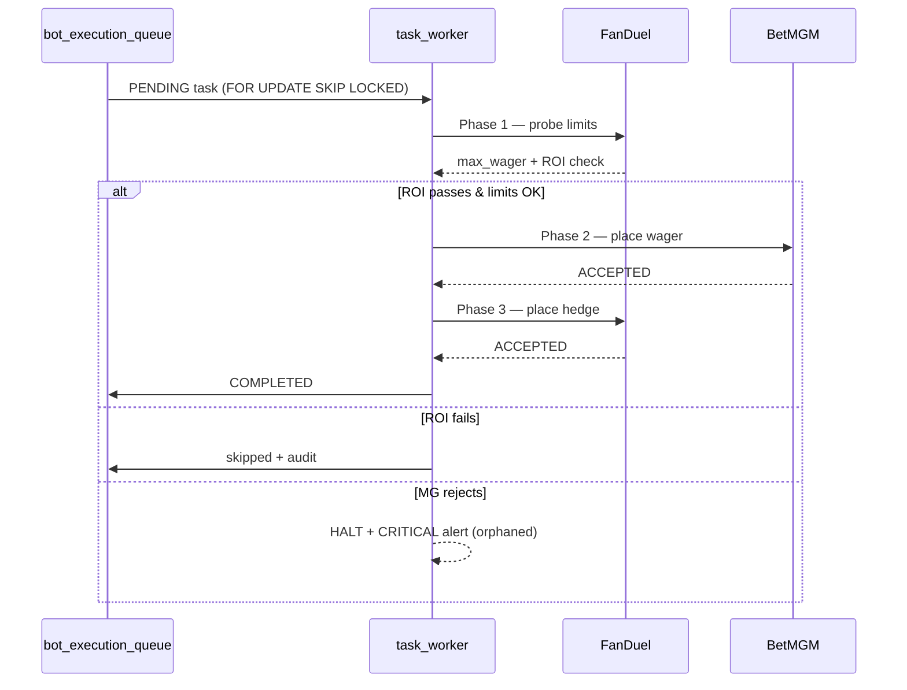

# Bot execution flow

The bot processes one task at a time from `bot_execution_queue`. Each task runs the three-phase pipeline in `execute_arb.ArbExecutor`: probe FanDuel for limits, place a wager on BetMGM, then hedge back on FanDuel. A failure in phase 2 _after_ phase 1 succeeded triggers a `CRITICAL` orphaned-bet alert and halts the worker.

## Decision graph (live)

Hover any node for run counts and average duration over the last 24h (data from `/api/wiki/bot-flow.json`). Toggle layers in the legend.

:::reactflow id="bot-decision-graph" endpoint="/api/wiki/bot-flow.json"
{
  "layers": [
    {"id": "execution",    "label": "Execution",         "color": "#a0aec0", "default": true},
    {"id": "decisions",    "label": "Decisions",         "color": "#a78bfa", "default": true},
    {"id": "value_stream", "label": "Value stream",      "color": "#f7c873", "default": true},
    {"id": "failures",     "label": "Recent failures",   "color": "#ef4444", "default": false}
  ],
  "nodes": [
    {"id": "queue_pick",          "position": {"x": 0,    "y": 60}, "data": {"label": "Queue pick"},                                   "layer": "execution"},
    {"id": "open_fd",             "position": {"x": 160,  "y": 60}, "data": {"label": "Open FanDuel"},                                 "layer": "execution"},
    {"id": "probe_decision",      "position": {"x": 320,  "y": 60}, "data": {"label": "Probe limits\nROI > min?"},                     "layer": "decisions"},
    {"id": "skip_audit",          "position": {"x": 200,  "y": 220}, "data": {"label": "Skip + audit"},                                "layer": "execution"},
    {"id": "outcome_skipped",     "position": {"x": 60,   "y": 220}, "data": {"label": "SKIPPED"},                                     "layer": "execution"},
    {"id": "search_mgm",          "position": {"x": 500,  "y": 60}, "data": {"label": "Search BetMGM"},                                "layer": "execution"},
    {"id": "select_market_mgm",   "position": {"x": 660,  "y": 60}, "data": {"label": "Select market tab"},                            "layer": "execution"},
    {"id": "enter_wager_mgm",     "position": {"x": 820,  "y": 60}, "data": {"label": "Enter wager"},                                  "layer": "execution"},
    {"id": "place_mgm_decision",  "position": {"x": 980,  "y": 60}, "data": {"label": "Place BetMGM\nconfirmed?"},                     "layer": "decisions"},
    {"id": "halt_orphan",         "position": {"x": 820,  "y": 220}, "data": {"label": "HALT + alert\norphaned bet"},                  "layer": "failures"},
    {"id": "outcome_failure",     "position": {"x": 980,  "y": 220}, "data": {"label": "FAILED"},                                      "layer": "execution"},
    {"id": "place_fd_hedge",      "position": {"x": 1160, "y": 60}, "data": {"label": "Place FD hedge"},                               "layer": "execution"},
    {"id": "outcome_success",     "position": {"x": 1320, "y": 60}, "data": {"label": "COMPLETED"},                                    "layer": "execution"}
  ],
  "edges": [
    {"id": "e1",  "source": "queue_pick",         "target": "open_fd"},
    {"id": "e2",  "source": "open_fd",            "target": "probe_decision"},
    {"id": "e3",  "source": "probe_decision",     "target": "skip_audit",        "label": "no",  "layer": "decisions"},
    {"id": "e4",  "source": "probe_decision",     "target": "search_mgm",        "label": "yes", "layer": "decisions"},
    {"id": "e5",  "source": "skip_audit",         "target": "outcome_skipped"},
    {"id": "e6",  "source": "search_mgm",         "target": "select_market_mgm"},
    {"id": "e7",  "source": "select_market_mgm",  "target": "enter_wager_mgm"},
    {"id": "e8",  "source": "enter_wager_mgm",    "target": "place_mgm_decision"},
    {"id": "e9",  "source": "place_mgm_decision", "target": "halt_orphan",       "label": "no",  "layer": "decisions"},
    {"id": "e10", "source": "place_mgm_decision", "target": "place_fd_hedge",    "label": "yes", "layer": "decisions"},
    {"id": "e11", "source": "halt_orphan",        "target": "outcome_failure",   "layer": "failures"},
    {"id": "e12", "source": "place_fd_hedge",     "target": "outcome_success"}
  ]
}
:::

> **v1 note:** this view collapses each phase into one node per step. The Phase D `/wiki:sync` skill will regenerate it with finer-grained UI-interaction sub-nodes (navigate, wait-for-element, dismiss-modal, etc.) once that pipeline is live; phase headers will become collapsible super-nodes to keep the dense view readable.

## Recurring issues observed (from the watcher)

| Axis | Pattern |
|------|---------|
| `auth_geo` | BetMGM credential modal triggers mid-Phase-2; session warmth keepalive needed. |
| `wasted_wait` | BetMGM search overlay freezes (5–67s); Chrome audio-device modal at startup (~6s). |
| `selector_miss` | BetMGM market sub-tab routing fails when player metadata differs from canonical mapping. |
| `slip_state` | Leftover bets occasionally seen at slip open; suspended-market banners flagged. |
| `stealth` | Sub-dollar wagers (ROI ≤ 0.4%) reaching execution; same-player same-market within ~30s = canonical correlation signal. |

See [the Watchers card on the dashboard](/) for current backlog and last-tick freshness per watcher.
